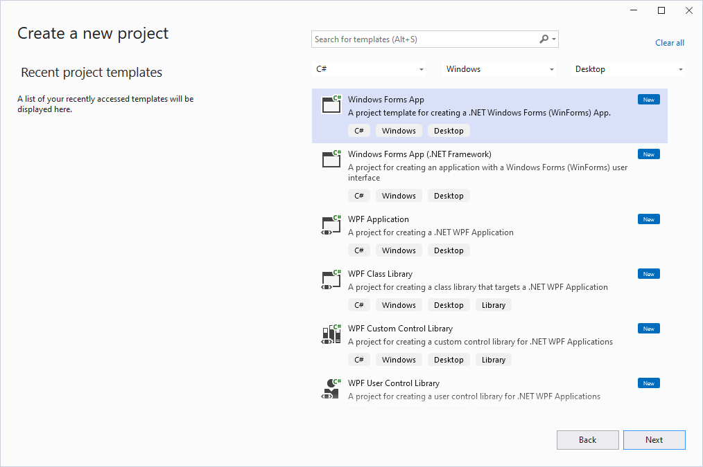

# 1 - Introduction

C# (pronounced "C sharp") is a modern, versatile programming language developed by Microsoft. It is commonly used for developing Windows applications, web applications, games, and more. In the context of Windows desktop applications, C# WinForms (Windows Forms) is a graphical user interface (GUI) framework that allows developers to create Windows-based applications with a user-friendly interface.

Here's a brief introduction to C# WinForms:

1. Windows Forms (WinForms):
Windows Forms is a graphical user interface (GUI) framework provided by Microsoft as part of the .NET Framework and later the .NET Core. It allows developers to create interactive and responsive Windows applications with various controls such as buttons, text boxes, labels, combo boxes, and more.

2. Getting Started:
To develop C# WinForms applications, you typically use an integrated development environment (IDE) like Visual Studio. Visual Studio provides a drag-and-drop interface for designing the user interface and a code editor for writing the application logic.

3. Creating a WinForms Application:
Here's a high-level overview of how you would create a simple WinForms application:

- Open Visual Studio and create a new C# Windows Forms Application project.
- Use the Form Designer to design the user interface by dragging and dropping controls onto the form.
- Customize properties of the controls (like text, appearance, behavior) using the Properties window.
- Write event handlers in C# to respond to user interactions. For example, you might write code that executes when a button is clicked.

4. Event-Driven Programming:
WinForms applications are built on an event-driven programming model. This means that your application responds to events like button clicks, mouse movements, and keyboard input. You write code to handle these events and define how your application should react to them.

5. Deployment:
Once your WinForms application is developed, you can deploy it to other computers. Users can run your application without needing to have Visual Studio installed, as long as the appropriate .NET runtime is present.

This is just a basic introduction to C# WinForms. The framework provides a wide range of controls, customization options, and tools for creating more complex and feature-rich applications. If you're interested in learning more, consider exploring tutorials and documentation available from Microsoft and other online resources.





7 - `MainForm.cs` - Console Application

```
namespace HelloWorldApp
{
    public partial class MainForm : Form
    {
        public MainForm()
        {
            InitializeComponent();

            // Set Window Title
            this.Text = "Hello World!";

            // Set Window Width and Height         
            this.Width = 400;
            this.Height = 200;

            // or

            // Set Window Width and Height
            Size = new Size(400, 200);
        }

        private void say_hello(object sender, EventArgs e)
        {
            Console.WriteLine("Hello, Winform");            
        }
    }
}
```

```
Project Properties -> Application -> Output Type -> Console Application
```


12 - `MainForm.cs` - Windows Application

```
namespace HelloWorldApp
{
    public partial class MainForm : Form
    {
        public MainForm()
        {
            InitializeComponent();

            // Set Window Title
            this.Text = "Hello World!";

            // Set Window Width and Height         
            this.Width = 400;
            this.Height = 200;

            // or

            // Set Window Width and Height
            Size = new Size(400, 200);
        }

        private void say_hello(object sender, EventArgs e)
        {           
            MessageBox.Show("Hello, Winform");
        }
    }
}
```

```
Project Properties -> Application -> Output Type -> Windows Application
```


