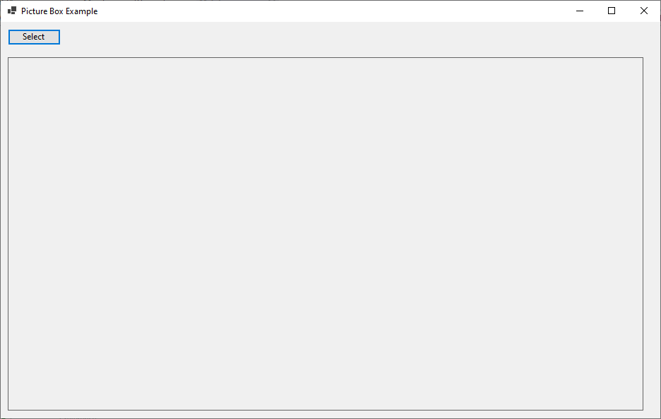
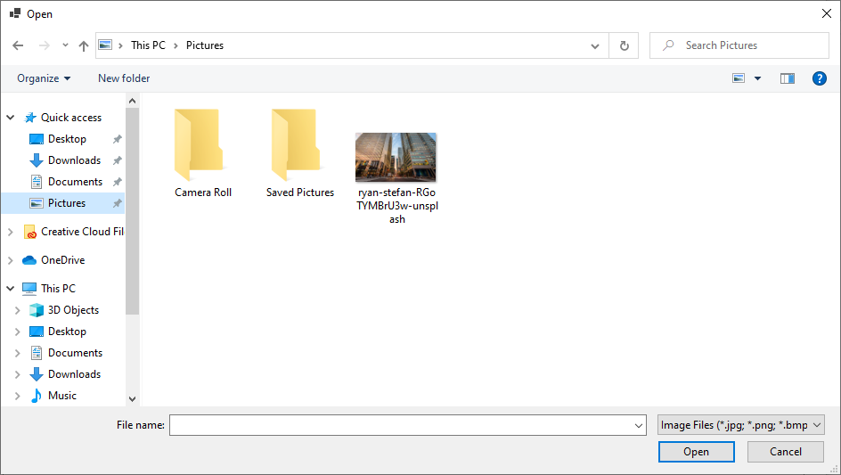
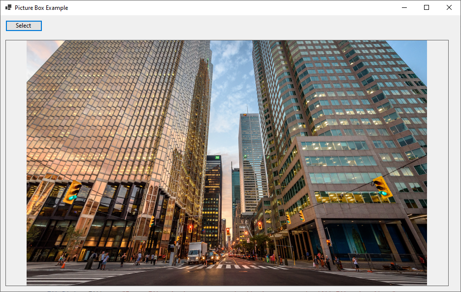

# 10 - PictureBox







4 - `MainForm.cs`

```
using System;
using System.Windows.Forms;

// Add this line for the Font class
using System.Drawing; 

namespace HelloWorldApp
{
    public partial class MainForm : Form
    {
        private Button selectImageButton;
        private PictureBox pictureBox;

        public MainForm()
        {
            InitializeUI();

            // Set Window Title
            this.Text = "Picture Box Example";

            // Set Window Width and Height         
            this.Width = 950;
            this.Height = 600;
           
        }

        private void InitializeUI()
        {
            selectImageButton = new Button
            {
                Text = "Select Image",
                Location = new Point(10, 10)
            };
            selectImageButton.Click += SelectImageButton_Click;

            pictureBox = new PictureBox
            {
                Location = new Point(10, 50),
                // Size Attribute Hieght, Width
                Size = new Size(900, 500),
                BorderStyle = BorderStyle.FixedSingle,
                SizeMode = PictureBoxSizeMode.Zoom
            };

            Controls.Add(selectImageButton);
            Controls.Add(pictureBox);
        }

        private void SelectImageButton_Click(object sender, EventArgs e)
        {
            using (OpenFileDialog openFileDialog = new OpenFileDialog())
            {
                openFileDialog.Filter = "Image Files (*.jpg; *.png; *.bmp)|*.jpg;*.png;*.bmp|All Files (*.*)|*.*";
                if (openFileDialog.ShowDialog() == DialogResult.OK)
                {
                    pictureBox.Image = Image.FromFile(openFileDialog.FileName);
                }
            }
        }
    }
}
```