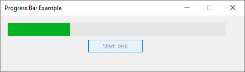

# 11 - ProgressBar





4 - `MainForm.cs`

```
namespace HelloWorldApp
{
    public partial class MainForm : Form
    {
        private ProgressBar progressBar;
        private Button startButton;

        public MainForm()
        {
            InitializeComponent();          

            this.Text = "Progress Bar Example";            

            this.Width = 500;
            this.Height = 150;
        }

        private void InitializeComponent()
        {
            this.progressBar = new System.Windows.Forms.ProgressBar();
            this.startButton = new System.Windows.Forms.Button();
            this.SuspendLayout();
            // 
            // progressBar
            // 
            this.progressBar.Location = new System.Drawing.Point(12, 12);
            this.progressBar.Name = "progressBar";
            this.progressBar.Size = new System.Drawing.Size(370, 23);
            this.progressBar.TabIndex = 0;
            // 
            // startButton
            // 
            this.startButton.Location = new System.Drawing.Point(148, 41);
            this.startButton.Name = "startButton";
            this.startButton.Size = new System.Drawing.Size(94, 23);
            this.startButton.TabIndex = 1;
            this.startButton.Text = "Start Task";
            this.startButton.UseVisualStyleBackColor = true;
            this.startButton.Click += new System.EventHandler(this.StartButton_Click);
            // 
            // MainForm
            // 
            this.AutoScaleDimensions = new System.Drawing.SizeF(6F, 13F);
            this.AutoScaleMode = System.Windows.Forms.AutoScaleMode.Font;
            this.ClientSize = new System.Drawing.Size(394, 76);
            this.Controls.Add(this.startButton);
            this.Controls.Add(this.progressBar);
            this.FormBorderStyle = System.Windows.Forms.FormBorderStyle.FixedDialog;
            this.MaximizeBox = false;
            this.Name = "MainForm";
            this.StartPosition = System.Windows.Forms.FormStartPosition.CenterScreen;
            this.Text = "ProgressBar Example";
            this.Load += new System.EventHandler(this.MainForm_Load);
            this.ResumeLayout(false);

        }

        private void StartButton_Click(object sender, EventArgs e)
        {
            // Disable the button while the task is running
            startButton.Enabled = false;

            // Simulate a task that takes some time to complete
            int totalSteps = 100;
            for (int i = 0; i <= totalSteps; i++)
            {
                // Update the progress bar
                progressBar.Value = (i * 100) / totalSteps;

                // Simulate some work being done
                Thread.Sleep(50);
            }

            // Enable the button after the task is completed
            startButton.Enabled = true;
        }

        private void MainForm_Load(object sender, EventArgs e)
        {
            // Set initial properties of controls
            progressBar.Minimum = 0;
            progressBar.Maximum = 100;
            progressBar.Value = 0;

            startButton.Text = "Start Task";
        }

    }
}
```