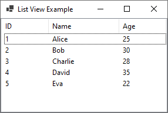
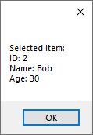

# 12 - ListView





3 - `MainForm.cs`

```
namespace HelloWorldApp
{
    public partial class MainForm : Form
    {
        private ListView listView1;

        public MainForm()
        {
            InitializeComponent();

            // Set Window Title
            this.Text = "List View Example";

            // Set Window Width and Height         
            this.Width = 300;
            this.Height = 200;

            // Populate the ListView with sample data
            AddSampleData();

            // Add the ListView to the form's Controls collection
            Controls.Add(listView1);
        }

        private void InitializeComponent()
        {
            // Create a new ListView control programmatically
            listView1 = new ListView();
            listView1.View = View.Details;
            listView1.FullRowSelect = true;
            listView1.Dock = DockStyle.Fill;

            // Add columns to the ListView
            listView1.Columns.Add("ID", 80);
            listView1.Columns.Add("Name", 120);
            listView1.Columns.Add("Age", 80);
        }

        private void AddSampleData()
        {
            // Sample data - you would typically load this from a data source
            string[,] sampleData = {
                { "1", "Alice", "25" },
                { "2", "Bob", "30" },
                { "3", "Charlie", "28" },
                { "4", "David", "35" },
                { "5", "Eva", "22" }
            };

            for (int i = 0; i < sampleData.GetLength(0); i++)
            {
                ListViewItem item = new ListViewItem(sampleData[i, 0]);
                item.SubItems.Add(sampleData[i, 1]);
                item.SubItems.Add(sampleData[i, 2]);
                listView1.Items.Add(item);
            }
        }

        private void listView1_SelectedIndexChanged(object sender, EventArgs e)
        {
            if (listView1.SelectedItems.Count > 0)
            {
                ListViewItem selectedItem = listView1.SelectedItems[0];
                string id = selectedItem.SubItems[0].Text;
                string name = selectedItem.SubItems[1].Text;
                string age = selectedItem.SubItems[2].Text;

                MessageBox.Show($"Selected Item:\nID: {id}\nName: {name}\nAge: {age}");
            }
        }
    }
}
```