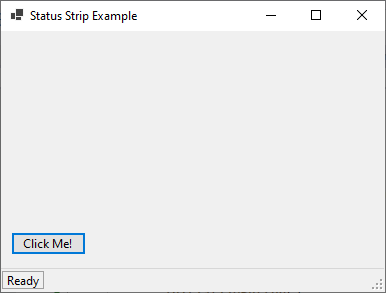
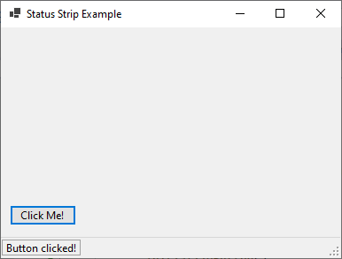

# 12 - ListView





3 - `MainForm.cs`

```
namespace HelloWorldApp
{
    public partial class MainForm : Form
    {
        private StatusStrip statusStrip;
        private ToolStripStatusLabel statusLabel;
        private Button button;
        public MainForm()
        {
            InitializeStatusStrip();
            InitializeButton();

            // Set Window Title
            this.Text = "Status Strip Example";

            // Set Window Width and Height         
            this.Width = 400;
            this.Height = 300;
        }

        private void InitializeStatusStrip()
        {
            // Create the StatusStrip control
            statusStrip = new StatusStrip();

            // Create a ToolStripStatusLabel
            statusLabel = new ToolStripStatusLabel();
            statusLabel.Text = "Ready";
            statusLabel.BorderSides = ToolStripStatusLabelBorderSides.All; // Optional border

            // Add the label to the StatusStrip
            statusStrip.Items.Add(statusLabel);

            // Attach the StatusStrip to the form
            Controls.Add(statusStrip);
        }

        private void InitializeButton()
        {
            // Create a Button
            button = new Button();
            button.Text = "Click Me!";
            button.Click += Button_Click;

            // Position the button
            button.Top = statusStrip.Bottom - 60;
            button.Left = 10;

            // Attach the button to the form
            Controls.Add(button);
        }


        // Method to update the status label text
        private void UpdateStatusLabel(string text)
        {
            statusLabel.Text = text;
        }

        // Example event handler to update the status label
        private void Button_Click(object sender, EventArgs e)
        {
            UpdateStatusLabel("Button clicked!");
        }
    }
}
```