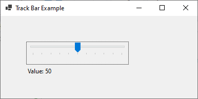
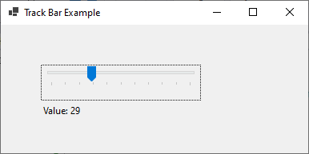
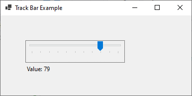

# 22 - TrackBar







4 - `MainForm.cs`

```
namespace HelloWorldApp
{
    public partial class MainForm : Form
    {
        private TrackBar trackBar1;
        private Label label1;

        public MainForm()
        {            

            this.Text = "Track Bar Example";

            this.Width = 400;
            this.Height = 200;

            // Assign the MainForm_Load event handler to the Load event
            this.Load += MainForm_Load;
        }

        private void MainForm_Load(object sender, EventArgs e)
        {
            InitializeComponent();
        }

        private void InitializeComponent()
        {
            // Set the properties of the TrackBar
            trackBar1 = new TrackBar();
            trackBar1.Minimum = 0;
            trackBar1.Maximum = 100;
            trackBar1.Value = 50;
            trackBar1.TickFrequency = 10;
            trackBar1.Location = new System.Drawing.Point(50, 50);
            trackBar1.Width = 200;

            // Subscribe to the ValueChanged event
            trackBar1.ValueChanged += TrackBar1_ValueChanged;

            // Set up the label to display the TrackBar value
            label1 = new Label();
            label1.Text = "Value: " + trackBar1.Value;
            label1.Location = new System.Drawing.Point(50, 100);

            // Add controls to the form
            Controls.Add(trackBar1);
            Controls.Add(label1);
        }

        private void TrackBar1_ValueChanged(object sender, EventArgs e)
        {
            // Update the label to display the current value of the TrackBar
            label1.Text = "Value: " + trackBar1.Value;
        }

    }
}
```