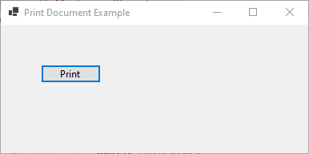
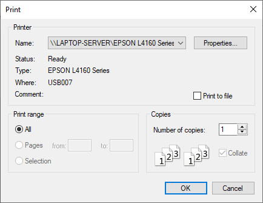

# 34 - PrintDocument





3 - `MainForm.cs`

```
using System.Drawing.Printing;

namespace HelloWorldApp
{
    public partial class MainForm : Form
    {
        private PrintDocument printDocument;

        private Button PrintButton;        

        public MainForm()
        {
            InitializeComponent();

            printDocument = new PrintDocument();
            printDocument.PrintPage += PrintDocument_PrintPage;


            this.Text = "Print Document Example";
            this.Width = 400;
            this.Height = 300;
        }

        private void InitializeComponent()
        {
            this.PrintButton = new System.Windows.Forms.Button();
            this.SuspendLayout();
            // 
            // PrintButton
            // 
            this.PrintButton.Location = new System.Drawing.Point(12, 12);
            this.PrintButton.Name = "PrintButton";
            this.PrintButton.Size = new System.Drawing.Size(75, 23);
            this.PrintButton.TabIndex = 0;
            this.PrintButton.Text = "Print";
            this.PrintButton.UseVisualStyleBackColor = true;
            this.PrintButton.Click += new System.EventHandler(this.PrintButton_Click);
            // 
            // MainForm
            // 
            this.AutoScaleDimensions = new System.Drawing.SizeF(6F, 13F);
            this.AutoScaleMode = System.Windows.Forms.AutoScaleMode.Font;
            this.ClientSize = new System.Drawing.Size(200, 100);
            this.Controls.Add(this.PrintButton);
            this.Name = "MainForm";
            this.Text = "PrintDocument Example";
            this.ResumeLayout(false);

        }
        
        private void PrintDocument_PrintPage(object sender, PrintPageEventArgs e)
        {
            // Create a font and brush for the text
            Font font = new Font("Arial", 12);
            SolidBrush brush = new SolidBrush(Color.Black);

            // Define the text to be printed
            string textToPrint = "Hello, this is a test document.";

            // Calculate the position for the text
            float x = e.MarginBounds.Left;
            float y = e.MarginBounds.Top;

            // Draw the text on the page
            e.Graphics.DrawString(textToPrint, font, brush, x, y);

            // Dispose of the font and brush
            font.Dispose();
            brush.Dispose();

            // Check if there are more pages to print
            e.HasMorePages = false;
        }

        private void PrintButton_Click(object sender, EventArgs e)
        {
            // Show print dialog to allow user to choose printer settings
            PrintDialog printDialog = new PrintDialog();
            printDialog.Document = printDocument;

            if (printDialog.ShowDialog() == DialogResult.OK)
            {
                // Start the printing process
                printDocument.Print();
            }
        }
    }
}
```