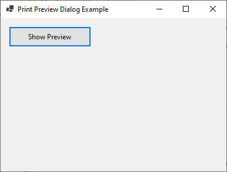
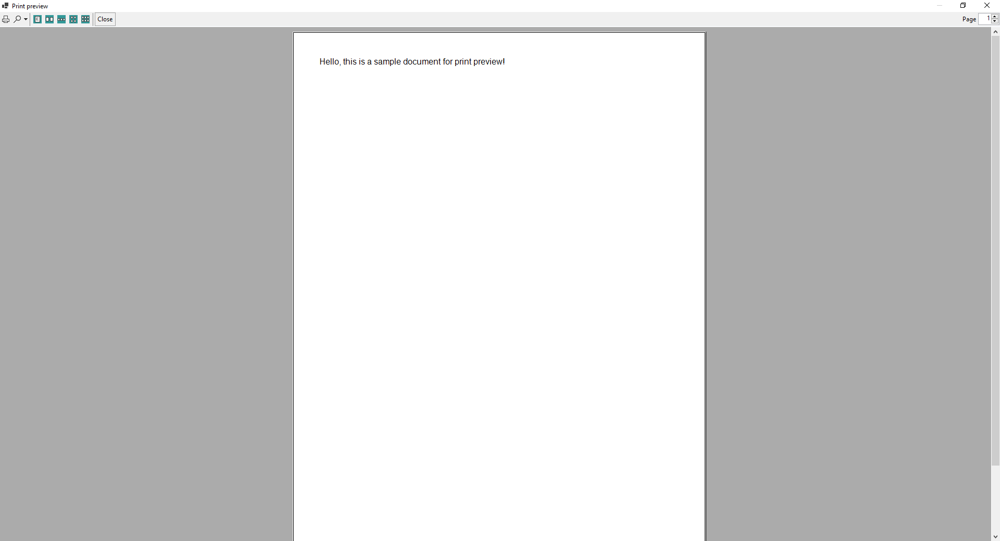
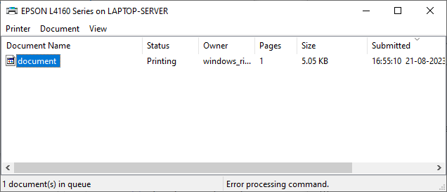

# 35 - PrintPreviewDialog







4 - `MainForm.cs`

```
using System.Drawing.Printing;

namespace HelloWorldApp
{
    public partial class MainForm : Form
    {
        private PrintDocument printDocument = new PrintDocument();
        private PrintPreviewDialog printPreviewDialog = new PrintPreviewDialog();
        private bool printingForPreview = false;

        private Button btnShowPreview;

        public MainForm()
        {
            InitializeComponent();

            printDocument.PrintPage += PrintDocument_PrintPage;
            printPreviewDialog.Document = printDocument;

            this.Text = "Print Preview Dialog Example";
            this.Width = 400;
            this.Height = 300;
        }

        private void PrintDocument_PrintPage(object sender, PrintPageEventArgs e)
        {
            if (printingForPreview)
            {
                // Your printing logic for the preview goes here
                string text = "Hello, this is a sample document for print preview!";
                Font font = new Font("Arial", 12);

                Brush brush = Brushes.Black;
                PointF point = new PointF(50, 50);

                e.Graphics.DrawString(text, font, brush, point);
            }
        }

        private void btnShowPreview_Click(object sender, EventArgs e)
        {
            printingForPreview = true; // Set the flag to indicate preview printing
            printPreviewDialog.ShowDialog();
            printingForPreview = false; // Reset the flag
        }

        private void InitializeComponent()
        {
            this.btnShowPreview = new System.Windows.Forms.Button();
            this.SuspendLayout();

            // btnShowPreview setup
            this.btnShowPreview.Location = new System.Drawing.Point(12, 12);
            this.btnShowPreview.Name = "btnShowPreview";

            this.btnShowPreview.Size = new System.Drawing.Size(120, 30);
            this.btnShowPreview.TabIndex = 0;

            this.btnShowPreview.Text = "Show Preview";
            this.btnShowPreview.UseVisualStyleBackColor = true;

            this.btnShowPreview.Click += new System.EventHandler(this.btnShowPreview_Click);

            // MainForm setup
            this.AutoScaleDimensions = new System.Drawing.SizeF(6F, 13F);
            this.AutoScaleMode = System.Windows.Forms.AutoScaleMode.Font;

            this.ClientSize = new System.Drawing.Size(284, 261);
            this.Controls.Add(this.btnShowPreview);

            this.Name = "MainForm";
            this.Text = "Print Preview Example";

            this.ResumeLayout(false);
        }

        
    }
}
```