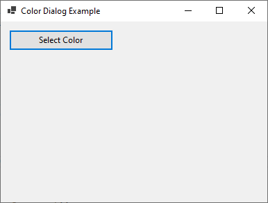
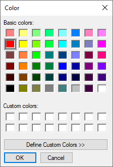

# 36 - ColorDialog






4 - `MainForm.cs`

```
namespace HelloWorldApp
{
    public partial class MainForm : Form
    {
        private Button selectColorButton;
        private Panel colorPanel;

        public MainForm()
        {
            InitializeComponent();

            // Set Window Title
            this.Text = "Color Dialog Example";

            // Set Window Width and Height         
            this.Width = 400;
            this.Height = 300;
        }

        private void InitializeComponent()
        {
            this.selectColorButton = new Button();
            this.colorPanel = new Panel();

            // selectColorButton
            this.selectColorButton.Location = new Point(12, 12);
            this.selectColorButton.Size = new Size(150, 30);
            this.selectColorButton.Text = "Select Color";
            this.selectColorButton.Click += new EventHandler(selectColorButton_Click);

            // colorPanel
            this.colorPanel.Location = new Point(12, 50);
            this.colorPanel.Size = new Size(150, 150);

            // MainForm
            this.ClientSize = new Size(200, 220);
            this.Controls.Add(this.colorPanel);
            this.Controls.Add(this.selectColorButton);
            this.Text = "Color Dialog Example";
        }

        private void selectColorButton_Click(object sender, EventArgs e)
        {
            ColorDialog colorDialog = new ColorDialog();

            // Show the dialog and check if the user clicked OK
            if (colorDialog.ShowDialog() == DialogResult.OK)
            {
                // Get the selected color
                Color selectedColor = colorDialog.Color;

                // Apply the selected color to the panel's BackColor
                colorPanel.BackColor = selectedColor;
            }
        }
    }
}
```