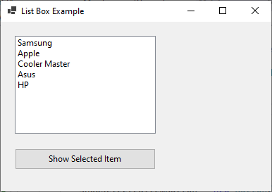
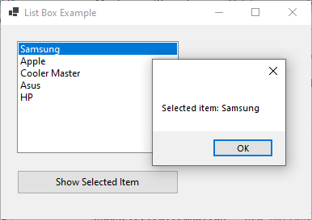

# 7 - ListBox





3 - `MainForm.cs`

```
namespace HelloWorldApp
{
    public partial class MainForm : Form
    {
        private ListBox listBox;
        private Button showSelectedItemButton;

        public MainForm()
        {
            InitializeComponent();
            InitializeButton();

            // Set Window Title
            this.Text = "List Box Example";

            // Set Window Width and Height         
            this.Width = 400;
            this.Height = 280;
        }

        private void InitializeComponent()
        {
            listBox = new ListBox();
            listBox.Location = new System.Drawing.Point(20, 20);
            listBox.Size = new System.Drawing.Size(200, 150);

            // Add items to the list
            listBox.Items.Add("Samsung");
            listBox.Items.Add("Apple");
            listBox.Items.Add("Cooler Master");
            listBox.Items.Add("Asus");
            listBox.Items.Add("HP");

            // Subscribe to the selected index changed event
            listBox.SelectedIndexChanged += ListBox_SelectedIndexChanged;

            // Add the listbox to the form's controls collection
            Controls.Add(listBox);
        }

        private void ListBox_SelectedIndexChanged(object sender, EventArgs e)
        {
            // Handle the selected index changed event
            if (listBox.SelectedIndex != -1)
            {
                MessageBox.Show($"Selected item: {listBox.SelectedItem}");
            }
        }

        private void InitializeButton()
        {
            showSelectedItemButton = new Button();
            showSelectedItemButton.Text = "Show Selected Item";
            showSelectedItemButton.Location = new System.Drawing.Point(20, 180);
            showSelectedItemButton.Size = new System.Drawing.Size(200, 30);

            // Subscribe to the button's click event
            showSelectedItemButton.Click += ShowSelectedItemButton_Click;

            // Add the button to the form's controls collection
            Controls.Add(showSelectedItemButton);
        }

        private void ShowSelectedItemButton_Click(object sender, EventArgs e)
        {
            // Button click event handler
            if (listBox.SelectedIndex != -1)
            {
                MessageBox.Show($"Selected item: {listBox.SelectedItem}");
            }
            else
            {
                MessageBox.Show("No item selected.");
            }
        }
    }
}
```