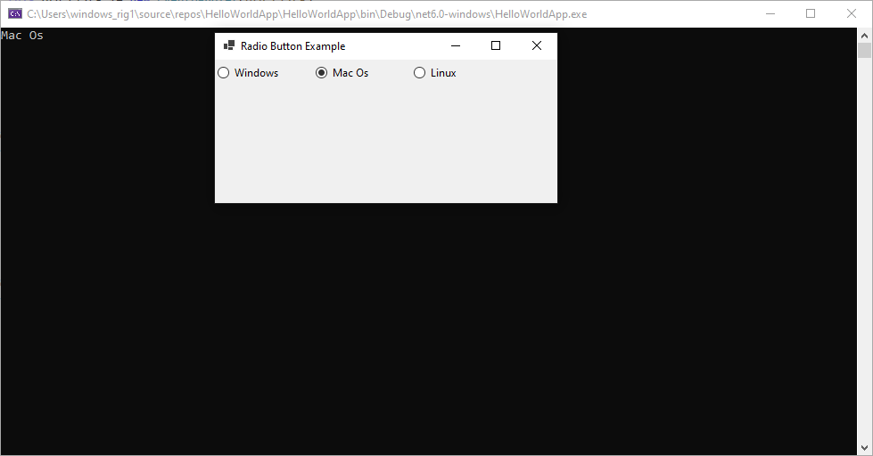

# 9 - RadioButton




4 - `MainForm.cs`

```
namespace HelloWorldApp
{
    public partial class MainForm : Form
    {
        private FlowLayoutPanel radioPanel;
        private RadioButton rb1, rb2, rb3;
        private Button btn;

        public MainForm()
        {
            InitializeComponent();

            // Set Window Title
            this.Text = "Radio Button Example";

            // Set Window Width and Height         
            this.Width = 400;
            this.Height = 200;
        }

        private void InitializeComponent()
        {
            this.radioPanel = new FlowLayoutPanel();
            this.rb1 = new RadioButton();
            this.rb2 = new RadioButton();
            this.rb3 = new RadioButton();
            this.btn = new Button();
            this.SuspendLayout();

            this.radioPanel.FlowDirection = FlowDirection.LeftToRight;
            this.radioPanel.AutoSize = true;

            // create the radio buttons
            this.rb1.Text = "Windows";
            this.rb1.CheckedChanged += new EventHandler(rb_CheckedChanged);

            this.rb2.Text = "Mac Os";
            this.rb2.CheckedChanged += new EventHandler(rb_CheckedChanged);

            this.rb3.Text = "Linux";
            this.rb3.CheckedChanged += new EventHandler(rb_CheckedChanged);

            // set the default selection
            this.rb2.Checked = true;

            // add the radio buttons to the FlowLayoutPanel
            this.radioPanel.Controls.Add(this.rb1);
            this.radioPanel.Controls.Add(this.rb2);
            this.radioPanel.Controls.Add(this.rb3);

            // create a button to show the selected value
            this.btn.Text = "Show selected";
            this.btn.Click += new EventHandler(btn_Click);

            // add controls to the form
            this.Controls.Add(this.radioPanel);
            this.Controls.Add(this.btn);

            this.ResumeLayout(false);
        }

        private void rb_CheckedChanged(object sender, EventArgs e)
        {
            RadioButton radioButton = sender as RadioButton;
            if (radioButton != null && radioButton.Checked)
            {
                Console.WriteLine(radioButton.Text);
            }
        }

        private void btn_Click(object sender, EventArgs e)
        {
            if (rb1.Checked)
            {
                Console.WriteLine(rb1.Text);
            }
            else if (rb2.Checked)
            {
                Console.WriteLine(rb2.Text);
            }
            else if (rb3.Checked)
            {
                Console.WriteLine(rb3.Text);
            }
        }
    }
}
```