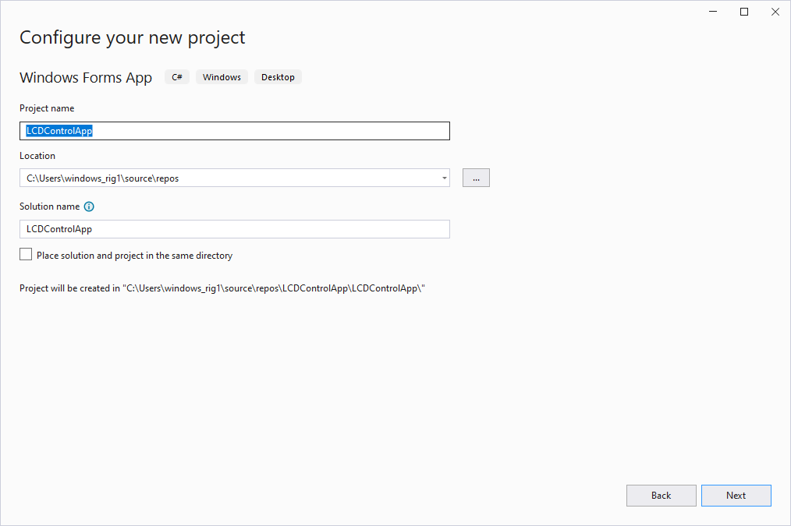
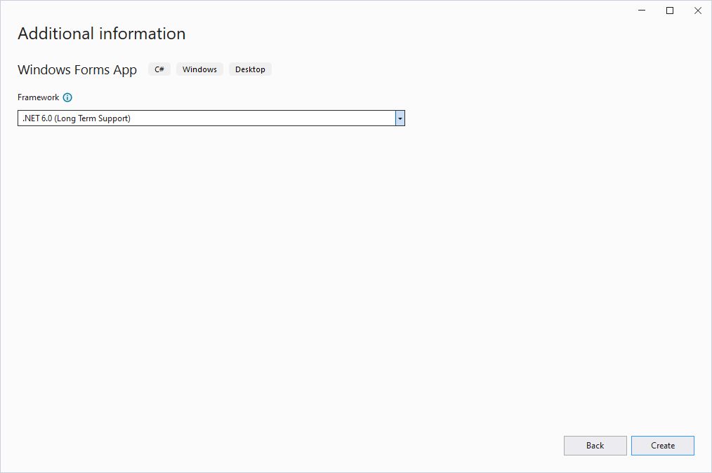
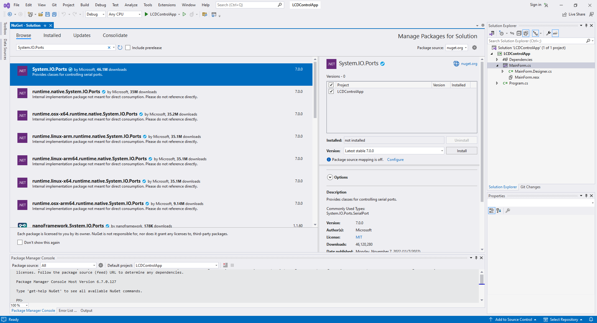
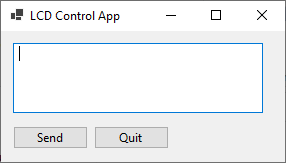
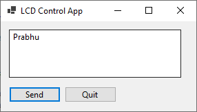

# Arduino LCD Control via Winform GUI














**10 - `Arduino Code`**

```
#include <Wire.h>
#include <LiquidCrystal_I2C.h>

LiquidCrystal_I2C lcd(0x27, 16, 2);

void setup() 
{

  lcd.init();

  lcd.backlight();

  lcd.print("Hello World!");

  // Start serial communication
  Serial.begin(9600);
}

void loop() 
{

  if (Serial.available()) 
  {
    
    // Read the incoming data
    String receivedData = Serial.readString();
    
    // Clear the LCD
    lcd.clear();
    
    // Set cursor to the beginning of the first line
    lcd.setCursor(0, 0);

    // Print the received data on the LCD
    lcd.print(receivedData);
    
  }
  
  // Your other loop code here...
}
```

**11 - `MainForm.cs`**

```
using System;
using System.IO.Ports;
using System.Text;
using System.Windows.Forms;

namespace LCDControlApp
{
    public partial class MainForm : Form
    {
        private SerialPort serialPort;

        public MainForm()
        {
            InitializeComponent();
            InitializeSerialPort();

            // Set Window Title
            this.Text = "LCD Control App";
        }

        private void InitializeSerialPort()
        {
            try
            {
                serialPort = new SerialPort("COM6", 9600);
                serialPort.Open();
            }
            catch (Exception e)
            {
                MessageBox.Show($"Error opening serial port: {e.Message}");
            }
        }

        private void SendToLCD()
        {
            string text = entryTextBox.Text;
            Console.WriteLine(text);
            serialPort.Write(text);
            Console.WriteLine(Encoding.ASCII.GetBytes(text));
            // Send a newline character to indicate the end of the message
            // serialPort.Write("\n");
        }

        private void SendButton_Click(object sender, EventArgs e)
        {
            SendToLCD();
        }

        private void QuitButton_Click(object sender, EventArgs e)
        {
            serialPort.Close();
            Close();
        }
    }
}
```