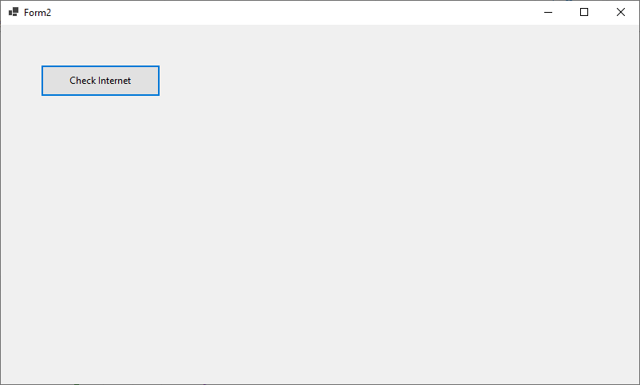
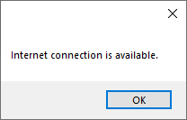
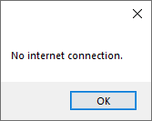

`NetworkInterface.GetIsNetworkAvailable()` **does NOT check internet**.
It only checks whether **any network interface is present and enabled** (LAN, Wi-Fi adapter, Virtual adapter, etc).

So even if you **disable the main network card**, Windows may still have:

* VirtualBox adapter
* Hyper-V adapter
* Bluetooth network
* Loopback adapter

Because of that, `GetIsNetworkAvailable()` returns **true**.

✅ **Correct way:** Try to **ping a real internet server** like `8.8.8.8` (Google DNS) or make a **web request**.

---

# ✅ Method 1 (Recommended) – Ping Google DNS

```csharp
using System.Net.NetworkInformation;

public bool IsInternetAvailable()
{
    try
    {
        using (Ping ping = new Ping())
        {
            PingReply reply = ping.Send("8.8.8.8", 2000);

            if (reply.Status == IPStatus.Success)
                return true;
        }
    }
    catch { }

    return false;
}
```

Use it like this:

```csharp
private void BtnCheckInternet_Click(object sender, EventArgs e)
{
    if (IsInternetAvailable())
        MessageBox.Show("Internet Available");
    else
        MessageBox.Show("No Internet");
}
```

---

# ✅ Method 2 – Check Website Response

```csharp
using System.Net;

public bool IsInternetAvailable()
{
    try
    {
        using (var client = new WebClient())
        using (client.OpenRead("http://clients3.google.com/generate_204"))
            return true;
    }
    catch
    {
        return false;
    }
}
```

This is actually **what Android uses to detect internet**.

---

# ⚡ Best POS System Method (Industry Standard)

Professional POS software usually checks:

1️⃣ Network adapter available
2️⃣ Ping gateway
3️⃣ Ping internet

Example logic:

```
Adapter Available -> TRUE
Ping Router -> TRUE
Ping Internet -> TRUE
= Internet OK
```

---

# 🚀 Bonus (Better WinForms UX)

Instead of clicking button, **auto detect internet status like POS systems**:

```
🟢 Online
🔴 Offline
```

using

```
NetworkChange.NetworkAvailabilityChanged
```

It updates **instantly when internet disconnects**.

---

✅ If you want, I can also give you a **Professional Reusable WinForms Component**:

**POS Style Internet Status Indicator**

```
🟢 Online
🔴 Offline
```

Features:

✔ Auto detect
✔ Ping verification
✔ Status icon
✔ Reusable control
✔ Works in any WinForms project

Just tell me 👍 and I'll share the **full component code**.

```csharp
using System;
using System.Collections.Generic;
using System.ComponentModel;
using System.Data;
using System.Drawing;
using System.Text;
using System.Windows.Forms;

using System.Net.NetworkInformation;
using static System.Net.WebRequestMethods;

namespace WinFormsApp1
{
    public partial class Form2 : Form
    {

        Button btnCheckInternet;

        public Form2()
        {
            InitializeComponent();

            CreateButton();   // create button dynamically
        }

        private void CreateButton()
        {
            btnCheckInternet = new Button();
            btnCheckInternet.Text = "Check Internet";
            btnCheckInternet.Width = 150;
            btnCheckInternet.Height = 40;
            btnCheckInternet.Top = 50;
            btnCheckInternet.Left = 50;

            // attach click event
            btnCheckInternet.Click += BtnCheckInternet_Click;

            // add button to form
            this.Controls.Add(btnCheckInternet);
        }

        private void BtnCheckInternet_Click(object sender, EventArgs e)
        {
            CheckInternetConnection();
        }

        public bool IsInternetAvailable()
        {
            try
            {
                using (Ping ping = new Ping())
                {
                    PingReply reply = ping.Send("8.8.8.8", 2000);

                    if (reply.Status == IPStatus.Success)
                        return true;
                }
            }
            catch { }

            return false;
        }

        public void CheckInternetConnection()
        {
            if(IsInternetAvailable())
            {
                MessageBox.Show("Internet connection is available.");
            }
            else
            {
                MessageBox.Show("No internet connection.");
            }
        }
    }
}
```



