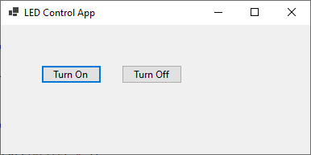
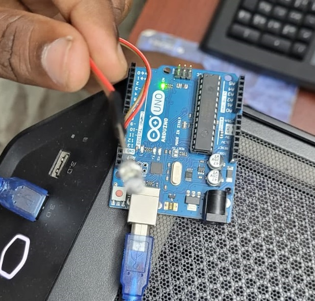
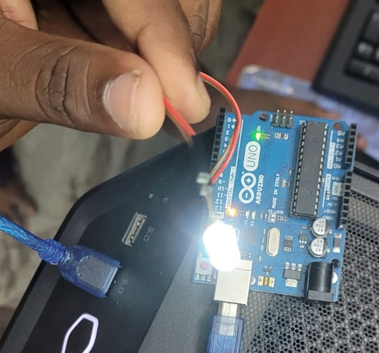

# Control Arduino LED Blink Using Winform GUI







4 - `Ardunio Code`

```
char userInput;

void setup()
{

  //  setup serial
  Serial.begin(9600);

  pinMode(LED_BUILTIN, OUTPUT);

}


void loop(){
  
  if(Serial.available()> 0){ 
        
    // read user input
    userInput = Serial.read();               
      
    if(userInput == 'o')
    {
      digitalWrite(LED_BUILTIN, HIGH); 
    }

    if(userInput == 'x')
    {
      digitalWrite(LED_BUILTIN, LOW);         
    }

  }

}
```

5 - `MainForm.cs`

```
using System;
using System.IO.Ports;
using System.Windows.Forms;

namespace HelloWorldApp
{
    public partial class MainForm : Form
    {
        private SerialPort serialPort;
        private Button btnOn;
        private Button btnOff;

        public MainForm()
        {
            InitializeComponent();
            InitializeSerialPort();            

            // Set Window Title
            this.Text = "LED Control App";

            // Set Window Width and Height         
            this.Width = 400;
            this.Height = 200;
        }

        private void InitializeComponent()
        {
            this.btnOn = new Button();
            this.btnOff = new Button();

            // Create "Turn On" button            
            this.btnOn.Text = "Turn On";
            this.btnOn.Click += new EventHandler(btn_On_Click);

            // Create "Turn Off" button            
            this.btnOff.Text = "Turn Off";
            this.btnOff.Click += new EventHandler(btn_Off_Click);

            // Layout the buttons
            this.SuspendLayout();
            this.btnOn.Location = new System.Drawing.Point(50, 50);
            this.btnOff.Location = new System.Drawing.Point(150, 50);

            // Add controls to the form
            this.Controls.Add(this.btnOn);
            this.Controls.Add(this.btnOff);

            this.ResumeLayout(false);
        }

        private void InitializeSerialPort()
        {
            try
            {
                serialPort = new SerialPort("COM6", 9600);
                serialPort.Open();
            }
            catch (Exception e)
            {
                MessageBox.Show($"Error opening serial port: {e.Message}");
            }
        }

        private void TurnOnLED()
        {
            serialPort.Write("o");
        }

        private void TurnOffLED()
        {
            serialPort.Write("x");
        }

        private void MainForm_FormClosing(object sender, FormClosingEventArgs e)
        {
            serialPort.Close();
        }

        private void btn_On_Click(object sender, EventArgs e)
        {
            TurnOnLED();
        }

        private void btn_Off_Click(object sender, EventArgs e)
        {
            TurnOffLED();
        }
    }
}
```