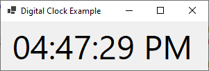
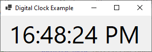

# Digital Clock





`MainForm.cs`

```
using System;
using System.Windows.Forms;
using System.Drawing; // Add this line for the Font class

namespace HelloWorldApp
{
    public partial class MainForm : Form
    {
        private Label clockLabel;
        public MainForm()
        {
            InitializeClockLabel();

            // Set Window Title
            this.Text = "Digital Clock Example";

            // Set Window Width and Height         
            this.Width = 315;
            this.Height = 110;

            // Update the label's text immediately
            UpdateClockLabel();

            System.Windows.Forms.Timer timer = new System.Windows.Forms.Timer();
            // Update every 1 second
            timer.Interval = 1000;
            timer.Tick += Timer_Tick;
            timer.Start();
        }

        private void InitializeClockLabel()
        {
            // Add a label to the form
            clockLabel = new Label();
            clockLabel.Text = "";

            // Set font size
            // Change the font size as needed
            clockLabel.Font = new Font("Segoe UI", 36, FontStyle.Regular);

            clockLabel.Location = new System.Drawing.Point(0, 0);

            clockLabel.TextAlign = ContentAlignment.MiddleCenter;
            clockLabel.Dock = DockStyle.Fill;

            // Add the label to the form's controls
            Controls.Add(clockLabel);
        }

        private void UpdateClockLabel()
        {
            // 12 Hour Format "tt" specifier adds the AM/PM designator
            clockLabel.Text = DateTime.Now.ToString("hh:mm:ss tt");

            // 24 Hour Format "tt" specifier adds the AM/PM designator
            //clockLabel.Text = DateTime.Now.ToString("HH:mm:ss tt");
        }

        private void Timer_Tick(object sender, EventArgs e)
        {
            UpdateClockLabel();
        }
    }
}
```