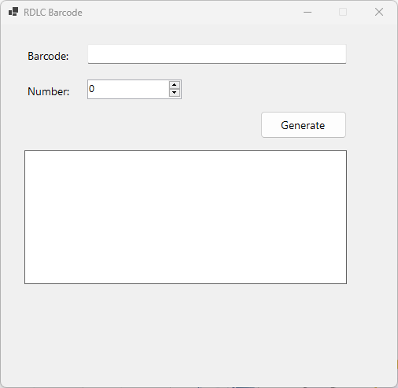
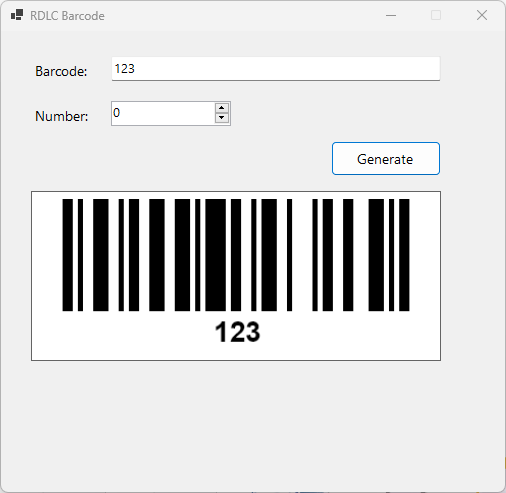

# Display Multiple Column Barcodes in RDLC Reports | FoxLearn 

```
https://www.youtube.com/watch?v=znAA0FDI1Ds
```

# BarcodeLib
```
https://www.nuget.org/packages/BarcodeLib/3.1.5?_src=template
```

```csharp
using BarcodeStandard;
using SkiaSharp;
using System;
using System.Collections.Generic;
using System.ComponentModel;
using System.Data;
using System.Drawing;
using System.Text;
using System.Windows.Forms;

namespace winform_bughunt_pos
{
    public partial class BarcodeForm : Form
    {
        private TextBox txtBarcode;
        private NumericUpDown numNumber;
        private Button btnGenerate;

        private PictureBox picPreview;

        public BarcodeForm()
        {
            InitializeComponent();
            CreateUI();
        }

        private void CreateUI()
        {
            // FORM
            this.Text = "RDLC Barcode";
            this.StartPosition = FormStartPosition.CenterScreen;
            this.FormBorderStyle = FormBorderStyle.FixedSingle;
            this.MaximizeBox = false;
            this.Size = new Size(520, 500);
            this.Font = new Font("Segoe UI", 10);

            // Barcode Label
            Label lblBarcode = new Label();
            lblBarcode.Text = "Barcode:";
            lblBarcode.Location = new Point(30, 30);
            lblBarcode.AutoSize = true;
            this.Controls.Add(lblBarcode);

            // Barcode TextBox
            txtBarcode = new TextBox();
            txtBarcode.Location = new Point(110, 25);
            txtBarcode.Size = new Size(330, 30);
            this.Controls.Add(txtBarcode);

            // Number Label
            Label lblNumber = new Label();
            lblNumber.Text = "Number:";
            lblNumber.Location = new Point(30, 75);
            lblNumber.AutoSize = true;
            this.Controls.Add(lblNumber);

            // NumericUpDown
            numNumber = new NumericUpDown();
            numNumber.Location = new Point(110, 70);
            numNumber.Size = new Size(120, 30);
            numNumber.Minimum = 0;
            numNumber.Maximum = 1000;
            this.Controls.Add(numNumber);

            // Generate Button
            btnGenerate = new Button();
            btnGenerate.Text = "Generate";
            btnGenerate.Location = new Point(330, 110);
            btnGenerate.Size = new Size(110, 35);
            btnGenerate.Click += BtnGenerate_Click;
            this.Controls.Add(btnGenerate);

            // PictureBox (Barcode Preview Area)
            picPreview = new PictureBox();
            picPreview.Location = new Point(30, 160);
            picPreview.Size = new Size(410, 170);
            picPreview.BorderStyle = BorderStyle.FixedSingle;
            picPreview.BackColor = Color.White;
            picPreview.SizeMode = PictureBoxSizeMode.Zoom;
            this.Controls.Add(picPreview);
        }

        private void BtnGenerate_Click(object sender, EventArgs e)
        {
            //MessageBox.Show("Barcode: " + txtBarcode.Text + "\nNumber: " + numNumber.Value);            

            try
            {
                if (string.IsNullOrWhiteSpace(txtBarcode.Text))
                {
                    MessageBox.Show("Enter barcode value");
                    return;
                }

                var b = new Barcode();
                b.IncludeLabel = true;

                int width = picPreview.Width - 10;
                int height = 150; // enough space for label text

                // Generate SKImage
                using (var skImage = b.Encode(
                    BarcodeStandard.Type.Code128,                     // Change type if needed
                    txtBarcode.Text.Trim(),
                    SKColors.Black,
                    SKColors.White,
                    width,
                    height))
                {
                    // Convert SKImage → Bitmap
                    using (var data = skImage.Encode(SKEncodedImageFormat.Png, 100))
                    using (var ms = new MemoryStream(data.ToArray()))
                    {
                        //picPreview.SizeMode = PictureBoxSizeMode.Zoom;
                        picPreview.Image = new Bitmap(ms);
                    }
                }
            }
            catch (Exception ex)
            {
                MessageBox.Show("Barcode Error:\n" + ex.Message);
            }
        }
    }
}
```


