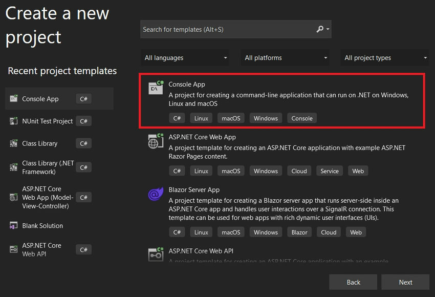
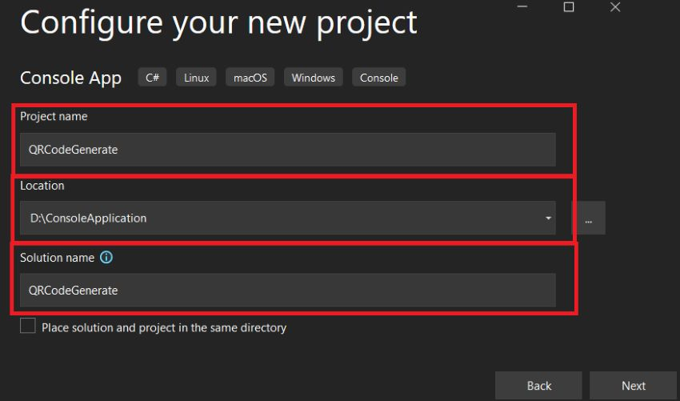
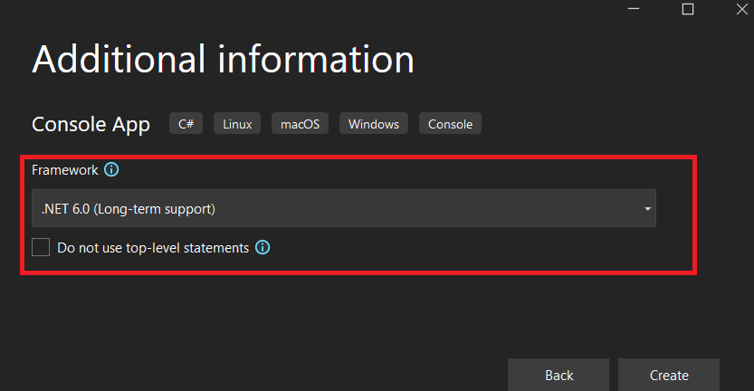
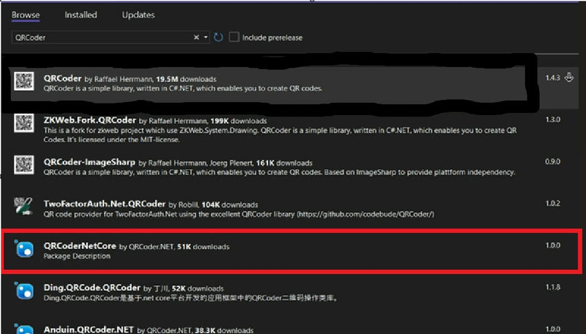

```
https://www.c-sharpcorner.com/article/generate-qr-code-using-c-sharp-console-application/
```

The provided code demonstrates a simple console application that is capable of Generating the QR Code.

Step 1. Create a new C# console application project. In Visual Studio, you can follow these steps.

    Open Visual Studio.
    Select "Create a new project" or go to "File" > "New" > "Project."
    Choose "Console App (.NET)" as the project template.



Enter a name for your project (e.g., "QRCodeGenerate") and Choose a location to save the project.


Select Framework and Click on Next.


Click "Create" to create the project.

Use the below code in Program.cs and replace all codes to Generate QR Codes.

```csharp
using System;
using System.Diagnostics;
using System.Drawing;
using System.Drawing.Imaging;
using QRCoder;

namespace QRCodeGenerate
{
    class Program
    {
        static void Main(string[] args)
        {
            Console.WriteLine("Enter the data to encode in the QR code:");
            string data = Console.ReadLine();

            // Generate the QR code
            QRCodeGenerator qrGenerator = new QRCodeGenerator();
            QRCodeData qrCodeData = qrGenerator.CreateQrCode(data, QRCodeGenerator.ECCLevel.Q);
            QRCode qrCode = new QRCode(qrCodeData);
            Bitmap qrCodeImage = qrCode.GetGraphic(20);


            // Specify the folder path to save the QR code image
            string folderPath = @"D:\QRCODE";

            // Create the folder if it doesn't exist
            if (!Directory.Exists(folderPath))
            {
                Directory.CreateDirectory(folderPath);
            }

            // Save the QR code as a PNG image file inside the specified folder
            string fileName = Path.Combine(folderPath, data + "_" + "QRCode.png");
            qrCodeImage.Save(fileName, ImageFormat.Png);

            // Display the QR code image using an image viewer application
            DisplayQRCodeImage(fileName);

            Console.ReadLine();
        }

        static void DisplayQRCodeImage(string imagePath)
        {
            try
            {
                // Check if the file exists
                if (System.IO.File.Exists(imagePath))
                {
                    // Use the default image viewer to open and display the QR code image
                    ProcessStartInfo psi = new ProcessStartInfo
                    {
                        FileName = imagePath,
                        UseShellExecute = true
                    };
                    Process.Start(psi);
                }
                else
                {
                    Console.WriteLine("QR code image not found.");
                }
            }
            catch (Exception ex)
            {
                Console.WriteLine($"Error: {ex.Message}");
            }
        }
    }
}
```

Downloading and Installing NuGet Packages.



To test the code, follow these steps,

Step 1. Set Output Directory

Set the outputDirectory variable to the directory where you want to save the QR Code. In the provided code, it is set to @"D:\QRCODE", but you can change it to any desired directory on your system.

Step 2. Enter the Data that you want to Generate the QR Code.

Enter any data you want to encode (e.g., a URL, some text, or contact information) and press Enter.

Step 3. Verify the QR in the Specific Location

The program will generate the QR code and save it as a PNG image in the folder D:\QRCODE (assuming this folder exists on your system).

After saving the image, the program will open the default image viewer to display the QR code image. You should be able to see the QR code image displayed by the image viewer.

If you encounter any issues or have further questions, feel free to let me know, and I'll be glad to assist!

Thank you for reading, and I hope this post has helped provide you with a better understanding of How to Generate a QR Code using the QRCoderNetCore Nuget Packet. 

"Keep coding, keep innovating, and keep pushing the boundaries of what's possible!

Happy Coding !!!