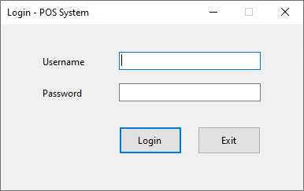
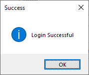
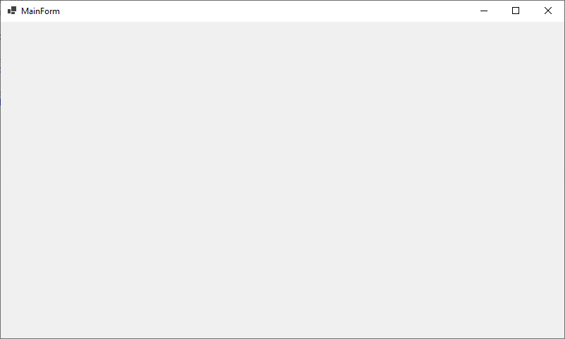

`LoginForm.cs`

```csharp
using System;
using System.Drawing;
using System.Windows.Forms;

namespace pos
{
    public partial class LoginForm : Form
    {
        Label lblUsername, lblPassword;
        TextBox txtUsername, txtPassword;
        Button btnLogin, btnExit;

        public LoginForm()
        {
            InitializeComponent();
            InitializeLoginUI();
        }

        private void InitializeLoginUI()
        {
            // Form settings
            this.Text = "Login - POS System";
            this.Size = new Size(400, 250);
            this.StartPosition = FormStartPosition.CenterScreen;
            this.FormBorderStyle = FormBorderStyle.FixedDialog;
            this.MaximizeBox = false;

            // Username Label
            lblUsername = new Label();
            lblUsername.Text = "Username";
            lblUsername.Location = new Point(50, 40);
            lblUsername.AutoSize = true;

            // Username TextBox
            txtUsername = new TextBox();
            txtUsername.Location = new Point(150, 35);
            txtUsername.Width = 180;

            // Password Label
            lblPassword = new Label();
            lblPassword.Text = "Password";
            lblPassword.Location = new Point(50, 80);
            lblPassword.AutoSize = true;

            // Password TextBox
            txtPassword = new TextBox();
            txtPassword.Location = new Point(150, 75);
            txtPassword.Width = 180;
            txtPassword.UseSystemPasswordChar = true;

            // Login Button
            btnLogin = new Button();
            btnLogin.Text = "Login";
            btnLogin.Location = new Point(150, 130);
            btnLogin.Size = new Size(120, 35);   // width, height
            btnLogin.Width = 80;
            btnLogin.Click += BtnLogin_Click;

            // Exit Button
            btnExit = new Button();
            btnExit.Text = "Exit";
            btnExit.Location = new Point(250, 130);
            btnExit.Size = new Size(120, 35);   // width, height
            btnExit.Width = 80;
            btnExit.Click += (s, e) => Application.Exit();

            // ENTER = Login | ESC = Exit
            this.AcceptButton = btnLogin;
            this.CancelButton = btnExit;

            // Add controls to form
            this.Controls.Add(lblUsername);
            this.Controls.Add(txtUsername);
            this.Controls.Add(lblPassword);
            this.Controls.Add(txtPassword);
            this.Controls.Add(btnLogin);
            this.Controls.Add(btnExit);

            // Default focus
            txtUsername.Focus();
        }

        private void BtnLogin_Click(object sender, EventArgs e)
        {
            if (txtUsername.Text == "" || txtPassword.Text == "")
            {
                MessageBox.Show("Please enter username and password",
                    "Warning", MessageBoxButtons.OK, MessageBoxIcon.Warning);
                return;
            }

            // Temporary check (replace with DB logic)
            if (txtUsername.Text == "admin" && txtPassword.Text == "1234")
            {
                MessageBox.Show("Login Successful",
                    "Success", MessageBoxButtons.OK, MessageBoxIcon.Information);

                // Open Main POS Form
                MainForm mainForm = new MainForm();
                mainForm.Show();

                // Hide login form
                this.Hide();
            }
            else
            {
                MessageBox.Show("Invalid username or password",
                    "Error", MessageBoxButtons.OK, MessageBoxIcon.Error);
            }
        }
    }
}
```

`MainForm.cs`
```csharp
using System;
using System.Collections.Generic;
using System.ComponentModel;
using System.Data;
using System.Drawing;
using System.Text;
using System.Windows.Forms;

namespace pos
{
    public partial class MainForm : Form
    {
        public MainForm()
        {
            InitializeComponent();
        }
    }
}
```



