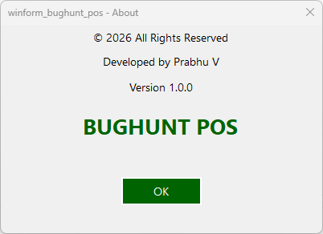

Since you're building a **WinForms POS system**, your About form should look clean, professional, and minimal — matching your POS UI style.

Here’s a **recommended professional AboutForm design** suitable for your `winform_bughunt_pos` project.

---

## ✅ Professional About Form Design Layout

```
 -----------------------------------------
|   🏪 BUGHUNT POS SYSTEM               |
|---------------------------------------|
|   Version 1.0.0                      |
|   Developed by Prabhu V              |
|   © 2026 All Rights Reserved         |
|                                       |
|        [ OK ]                        |
 -----------------------------------------
```

---

## ✅ Improved AboutForm Code (Professional UI)

Replace your constructor code with this:

```csharp
public AboutForm()
{
    InitializeComponent();

    AppConfig.ApplyFormTitle(this, "About");

    // ===== FORM SETTINGS =====
    this.FormBorderStyle = FormBorderStyle.FixedDialog;
    this.StartPosition = FormStartPosition.CenterScreen;
    this.MaximizeBox = false;
    this.MinimizeBox = false;
    this.ClientSize = new Size(400, 260);
    this.Font = new Font("Segoe UI", 10);

    // ===== APP NAME =====
    Label lblAppName = new Label();
    lblAppName.Text = "BUGHUNT POS";
    lblAppName.Dock = DockStyle.Top;
    lblAppName.Height = 60;
    lblAppName.Font = new Font("Segoe UI", 20, FontStyle.Bold);
    lblAppName.TextAlign = ContentAlignment.MiddleCenter;
    lblAppName.ForeColor = Color.DarkGreen;
    this.Controls.Add(lblAppName);

    // ===== VERSION =====
    Label lblVersion = new Label();
    lblVersion.Text = "Version 1.0.0";
    lblVersion.Dock = DockStyle.Top;
    lblVersion.Height = 35;
    lblVersion.TextAlign = ContentAlignment.MiddleCenter;
    this.Controls.Add(lblVersion);

    // ===== DEVELOPER =====
    Label lblDeveloper = new Label();
    lblDeveloper.Text = "Developed by Prabhu V";
    lblDeveloper.Dock = DockStyle.Top;
    lblDeveloper.Height = 30;
    lblDeveloper.TextAlign = ContentAlignment.MiddleCenter;
    this.Controls.Add(lblDeveloper);

    // ===== COPYRIGHT =====
    Label lblCopyright = new Label();
    lblCopyright.Text = "© 2026 All Rights Reserved";
    lblCopyright.Dock = DockStyle.Top;
    lblCopyright.Height = 30;
    lblCopyright.TextAlign = ContentAlignment.MiddleCenter;
    this.Controls.Add(lblCopyright);

    // ===== OK BUTTON =====
    Button btnOk = new Button();
    btnOk.Text = "OK";
    btnOk.Width = 100;
    btnOk.Height = 35;
    btnOk.Top = 190;
    btnOk.Left = (this.ClientSize.Width - btnOk.Width) / 2;
    btnOk.BackColor = Color.DarkGreen;
    btnOk.ForeColor = Color.White;
    btnOk.FlatStyle = FlatStyle.Flat;
    btnOk.Click += (s, e) => this.Close();
    this.Controls.Add(btnOk);
}
```

---

# 🔥 Optional (Recommended for Professional Look)

### 1️⃣ Show Dynamic Version Automatically

Instead of hardcoding version:

```csharp
lblVersion.Text = "Version " + Application.ProductVersion;
```

---

### 2️⃣ Add Logo at Top (Professional Touch)

```csharp
PictureBox picLogo = new PictureBox();
picLogo.Image = Properties.Resources.logo; // Add logo in resources
picLogo.SizeMode = PictureBoxSizeMode.Zoom;
picLogo.Dock = DockStyle.Top;
picLogo.Height = 70;
this.Controls.Add(picLogo);
picLogo.BringToFront();
```

---

# 💡 Pro Design Tips for POS Systems

* Use DarkGreen or Blue theme (professional retail feel)
* Keep About form small & simple
* Always show version dynamically
* Add company website/email (optional)
* Add build date if needed

---

If you want, I can also give you:

* ⭐ Modern Card-style About UI
* ⭐ Gradient background version
* ⭐ Enterprise-style About dialog
* ⭐ About form with system info (DB version, printer, etc.)

Tell me which style you want for your POS 👍




To automatically get the **version number from Project Properties (Assembly Info)** instead of hardcoding `"Version 1.0.0"`, use:

```csharp
using System.Reflection;
```

Then replace this line:

```csharp
lblVersion.Text = "Version 1.0.0";
```

with this:

```csharp
Version version = Assembly.GetExecutingAssembly().GetName().Version;
lblVersion.Text = $"Version {version.Major}.{version.Minor}.{version.Build}";
```

---

## ✅ Full Updated Version Section

```csharp
// ===== VERSION =====
Label lblVersion = new Label();
Version version = Assembly.GetExecutingAssembly().GetName().Version;
lblVersion.Text = $"Version {version.Major}.{version.Minor}.{version.Build}";
lblVersion.Dock = DockStyle.Top;
lblVersion.Height = 35;
lblVersion.TextAlign = ContentAlignment.MiddleCenter;
this.Controls.Add(lblVersion);
```

---

## 📌 Where This Version Comes From

It reads from:

**Project → Properties → Application → Assembly Information → Version**

or from your `.csproj` file:

```xml
<Version>1.0.0</Version>
```

---

## 🔥 Optional (Recommended for POS Apps)

If you want the full version including revision:

```csharp
lblVersion.Text = $"Version {version}";
```

Example output:

```
Version 1.0.0.0
```

---

If you want, I can also show you how to auto-increment build numbers on every release for your POS system.
