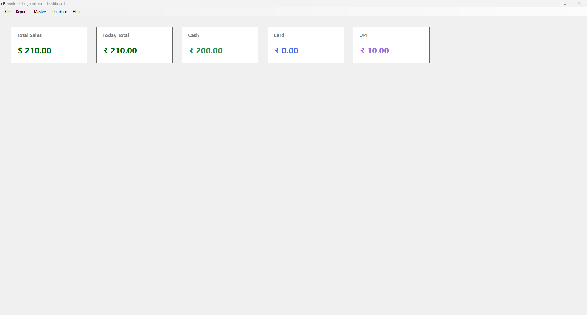

`Data.SaleRepository.cs`

```csharp
using System;
using System.Collections.Generic;
using System.Text;

namespace winform_bughunt_pos.Data
{
    public class SaleRepository
    {
        private DBHelper db = new DBHelper();

        // ==============================
        // TOTAL SALES
        // ==============================
        public decimal GetTotalSales()
        {
            string query = @"SELECT IFNULL(SUM(total_amount),0) 
                             FROM sales 
                             WHERE status = 'completed'";

            object result = db.ExecuteScalar(query);

            return Convert.ToDecimal(result);
        }

        // ==============================
        // TOTAL SALES TODAY
        // ==============================
        public decimal GetTodaySales()
        {
            string query = @"SELECT IFNULL(SUM(total_amount),0)
                             FROM sales
                             WHERE DATE(created_at) = CURDATE()
                             AND status = 'completed'";

            object result = db.ExecuteScalar(query);

            return Convert.ToDecimal(result);
        }

        // ==============================
        // TODAY SALES BY PAYMENT MODE
        // ==============================
        public decimal GetTodaySalesByPayment(string paymentMode)
        {
            string query = @"SELECT IFNULL(SUM(total_amount),0)
                             FROM sales
                             WHERE DATE(created_at) = CURDATE()
                             AND status = 'completed'
                             AND payment_mode = @mode";

            object result = db.ExecuteScalar(
                query,
                new MySql.Data.MySqlClient.MySqlParameter("@mode", paymentMode)
            );

            return Convert.ToDecimal(result);
        }
    }
}
```

`DashboardForm.cs`

```csharp
using System;
using System.Collections.Generic;
using System.ComponentModel;
using System.Data;
using System.Drawing;
using System.Text;
using System.Windows.Forms;
using winform_bughunt_pos.Data;
using winform_bughunt_pos.Enums;
using winform_bughunt_pos.Masters;
using winform_bughunt_pos.UI.Controls;

namespace winform_bughunt_pos
{
    public partial class DashboardForm : Form
    {
        private POSMenuControl posMenu;        
        public DashboardForm()
        {
            InitializeComponent();

            this.WindowState = FormWindowState.Maximized;

            AppConfig.ApplyFormTitle(this, "Dashboard");

            InitializeMenu();

            // ===== Dashboard Cards Panel =====
            FlowLayoutPanel cardPanel = new FlowLayoutPanel()
            {
                Dock = DockStyle.Top,
                Height = 180,
                Padding = new Padding(20),
                AutoSize = false
            };

            this.Controls.Add(cardPanel);
            cardPanel.BringToFront(); // show below menu

            // ===== Total Sales Card =====
            var saleRepo = new winform_bughunt_pos.Data.SaleRepository();
            decimal todaySales = saleRepo.GetTodaySales();

            var totalSalesCard = new UI.Controls.DashboardCardControl()
            {
                CardTitle = "Total Sales",
                CardValue = "$ " + todaySales.ToString("N2"),
                CardBackColor = Color.White,
                ValueColor = Color.DarkGreen
            };

            cardPanel.Controls.Add(totalSalesCard);

            // ===== TODAY TOTAL =====
            decimal todayTotal = saleRepo.GetTodaySales();

            var totalCard = new UI.Controls.DashboardCardControl()
            {
                CardTitle = "Today Total",
                CardValue = "₹ " + todayTotal.ToString("N2"),
                CardBackColor = Color.White,
                ValueColor = Color.DarkGreen
            };

            cardPanel.Controls.Add(totalCard);


            // ===== CASH =====
            decimal todayCash = saleRepo.GetTodaySalesByPayment("cash");

            var cashCard = new UI.Controls.DashboardCardControl()
            {
                CardTitle = "Cash",
                CardValue = "₹ " + todayCash.ToString("N2"),
                CardBackColor = Color.White,
                ValueColor = Color.SeaGreen
            };

            cardPanel.Controls.Add(cashCard);


            // ===== CARD =====
            decimal todayCard = saleRepo.GetTodaySalesByPayment("card");

            var cardPaymentCard = new UI.Controls.DashboardCardControl()
            {
                CardTitle = "Card",
                CardValue = "₹ " + todayCard.ToString("N2"),
                CardBackColor = Color.White,
                ValueColor = Color.RoyalBlue
            };

            cardPanel.Controls.Add(cardPaymentCard);


            // ===== UPI =====
            decimal todayUpi = saleRepo.GetTodaySalesByPayment("upi");

            var upiCard = new UI.Controls.DashboardCardControl()
            {
                CardTitle = "UPI",
                CardValue = "₹ " + todayUpi.ToString("N2"),
                CardBackColor = Color.White,
                ValueColor = Color.MediumPurple
            };

            cardPanel.Controls.Add(upiCard);
        }

        // =========================================================
        // MENU INITIALIZATION
        // =========================================================
        private void InitializeMenu()
        {
            posMenu = new POSMenuControl()
            {
                Dock = DockStyle.Top,
                Height = 30
            };

            // ===== FILE =====
            posMenu.NewBillClicked += OnNewBillClicked;
            posMenu.HoldBillClicked += OnHoldBillClicked;
            posMenu.ResumeBillClicked += OnResumeBillClicked;
            posMenu.SettingsClicked += OnSettingsClicked;
            posMenu.LogoutClicked += OnLogoutClicked;
            posMenu.ExitClicked += OnExitClicked;

            // ===== REPORTS =====
            posMenu.SalesReportClicked += OnSalesReportClicked;
            posMenu.PurchaseReportClicked += OnPurchaseReportClicked;
            posMenu.StockReportClicked += OnStockReportClicked;

            // ===== MASTERS =====
            posMenu.ProductsClicked += OnProductsClicked;
            posMenu.CustomersClicked += OnCustomersClicked;
            posMenu.SuppliersClicked += OnSuppliersClicked;

            // ===== DATABASE =====
            posMenu.BackupDatabaseClicked += OnBackupDatabaseClicked;
            posMenu.RestoreDatabaseClicked += OnRestoreDatabaseClicked;

            posMenu.AboutClicked += OnAboutClicked;

            this.Controls.Add(posMenu);
        }

        // =========================================================
        // FILE EVENTS
        // =========================================================
        private void OnNewBillClicked(object sender, EventArgs e)
        {
            this.Hide();
            UIForm1 uiForm1 = new UIForm1();
            uiForm1.Show();
        }

        private void OnHoldBillClicked(object sender, EventArgs e)
        {
            MessageBox.Show("Hold Bill Feature");
        }

        private void OnResumeBillClicked(object sender, EventArgs e)
        {
            MessageBox.Show("Resume Bill Feature");
        }

        private void OnSettingsClicked(object sender, EventArgs e)
        {
            MessageBox.Show("Open Settings");
        }

        private void OnLogoutClicked(object sender, EventArgs e)
        {
            MessageBox.Show("Logout");
        }

        private void OnExitClicked(object sender, EventArgs e)
        {
            Application.Exit();
        }

        // =========================================================
        // REPORT EVENTS
        // =========================================================
        private void OnSalesReportClicked(object sender, EventArgs e)
        {
            SaleReportForm reportForm = new SaleReportForm();
            reportForm.Show();
        }

        private void OnPurchaseReportClicked(object sender, EventArgs e)
        {
            MessageBox.Show("Open Purchase Report");
        }

        private void OnStockReportClicked(object sender, EventArgs e)
        {
            MessageBox.Show("Open Stock Report");
        }

        // =========================================================
        // MASTER EVENTS
        // =========================================================
        private void OnProductsClicked(object sender, EventArgs e)
        {
            ProductMasterForm form = new ProductMasterForm();
            form.Show();
        }

        private void OnCustomersClicked(object sender, EventArgs e)
        {
            CustomerMasterForm form = new CustomerMasterForm();
            form.Show();
        }

        private void OnSuppliersClicked(object sender, EventArgs e)
        {
            SupplierMasterForm form = new SupplierMasterForm();
            form.Show();
        }

        // =========================================================
        // DATABASE EVENTS
        // =========================================================
        private void OnBackupDatabaseClicked(object sender, EventArgs e)
        {
            try
            {
                var dbService = DatabaseFactory.Create(
                    AppConfig.GetDatabaseType(),
                    AppConfig.ConnectionString);

                dbService.Backup();
            }
            catch (Exception ex)
            {
                MessageBox.Show("Backup Failed:\n" + ex.Message);
            }
        }

        private void OnRestoreDatabaseClicked(object sender, EventArgs e)
        {
            try
            {
                if (MessageBox.Show(
                        "Restore will overwrite current data. Continue?",
                        "Warning",
                        MessageBoxButtons.YesNo,
                        MessageBoxIcon.Warning) == DialogResult.Yes)
                {
                    var dbService = DatabaseFactory.Create(
                        AppConfig.GetDatabaseType(),
                        AppConfig.ConnectionString);

                    dbService.Restore();
                }
            }
            catch (Exception ex)
            {
                MessageBox.Show("Restore Failed:\n" + ex.Message);
            }
        }

        private void OnAboutClicked(object sender, EventArgs e)
        {
            AboutForm form = new AboutForm();
            form.Show();
        }
        protected override void OnFormClosing(FormClosingEventArgs e)
        {
            Application.Exit();
            base.OnFormClosing(e);
        }
    }
}
```

