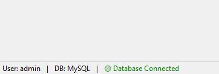
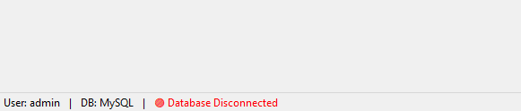

Here is your **clean, professional `README.md` documentation** for a simplified `DashboardForm` focused only on:

* Menu
* StatusStrip
* Database Monitoring (Blink + Auto Check)

All unrelated card/dashboard code has been removed for clarity.

You can copy this directly as:

```
README_DashboardForm.md
```

---

# 🖥 DashboardForm – Technical Documentation

## Overview

`DashboardForm` is the main container of the POS system.

This clean version includes:

* ✅ Top Menu (`POSMenuControl`)
* ✅ Bottom Status Bar (`StatusStrip`)
* ✅ Current Logged-in User Display
* ✅ Database Type Display
* ✅ Live Database Connection Monitoring
* ✅ Red Blinking Alert When Disconnected
* ✅ Auto Recheck Every 10 Seconds

---

# 🏗 Architecture

```
+--------------------------------------------------+
| POSMenuControl (Top Menu)                       |
+--------------------------------------------------+
|                                                  |
|              Main Workspace Area                |
|                                                  |
+--------------------------------------------------+
| User | DB Type | DB Connection Status (Blink)  |
+--------------------------------------------------+
```

---

# 📁 Clean DashboardForm.cs

```csharp
using System;
using System.Drawing;
using System.Windows.Forms;
using winform_bughunt_pos.Data;
using winform_bughunt_pos.UI.Controls;

namespace winform_bughunt_pos
{
    public partial class DashboardForm : Form
    {
        private POSMenuControl posMenu;

        private StatusStrip statusStrip;
        private ToolStripStatusLabel userLabel;
        private ToolStripStatusLabel dbTypeLabel;
        private ToolStripStatusLabel dbStatusLabel;

        private Timer dbBlinkTimer;
        private Timer dbCheckTimer;

        private bool blinkState = false;
        private bool isDbConnected = false;

        public DashboardForm()
        {
            InitializeComponent();

            this.WindowState = FormWindowState.Maximized;
            AppConfig.ApplyFormTitle(this, "Dashboard");

            InitializeMenu();
            InitializeStatusStrip();

            UpdateStatusBar();
            UpdateDatabaseStatus();

            StartDatabaseMonitoring();
        }

        // =========================================================
        // MENU
        // =========================================================
        private void InitializeMenu()
        {
            posMenu = new POSMenuControl()
            {
                Dock = DockStyle.Top,
                Height = 30
            };

            posMenu.ExitClicked += (s, e) => Application.Exit();

            this.Controls.Add(posMenu);
        }

        // =========================================================
        // STATUS STRIP
        // =========================================================
        private void InitializeStatusStrip()
        {
            statusStrip = new StatusStrip();
            statusStrip.Dock = DockStyle.Bottom;

            userLabel = new ToolStripStatusLabel();
            dbTypeLabel = new ToolStripStatusLabel();
            dbStatusLabel = new ToolStripStatusLabel();

            statusStrip.Items.Add(userLabel);
            statusStrip.Items.Add(new ToolStripStatusLabel(" | "));
            statusStrip.Items.Add(dbTypeLabel);
            statusStrip.Items.Add(new ToolStripStatusLabel(" | "));
            statusStrip.Items.Add(dbStatusLabel);

            this.Controls.Add(statusStrip);

            // Blink Timer
            dbBlinkTimer = new Timer();
            dbBlinkTimer.Interval = 500;
            dbBlinkTimer.Tick += DbBlinkTimer_Tick;
        }

        private void UpdateStatusBar()
        {
            userLabel.Text = $"User: {AppConfig.CurrentUser}";
            dbTypeLabel.Text = $"DB: {AppConfig.GetDatabaseType()}";
        }

        // =========================================================
        // DATABASE MONITORING
        // =========================================================
        private void StartDatabaseMonitoring()
        {
            dbCheckTimer = new Timer();
            dbCheckTimer.Interval = 10000; // 10 seconds
            dbCheckTimer.Tick += (s, e) => UpdateDatabaseStatus();
            dbCheckTimer.Start();
        }

        private void UpdateDatabaseStatus()
        {
            try
            {
                var dbService = DatabaseFactory.Create(
                    AppConfig.GetDatabaseType(),
                    AppConfig.ConnectionString);

                isDbConnected = dbService.TestConnection();

                if (isDbConnected)
                {
                    dbStatusLabel.Text = "🟢 Database Connected";
                    dbStatusLabel.ForeColor = Color.Green;
                    dbBlinkTimer.Stop();
                }
                else
                {
                    dbStatusLabel.Text = "🔴 Database Disconnected";
                    dbStatusLabel.ForeColor = Color.Red;
                    dbBlinkTimer.Start();
                }
            }
            catch
            {
                isDbConnected = false;
                dbStatusLabel.Text = "🔴 Database Disconnected";
                dbStatusLabel.ForeColor = Color.Red;
                dbBlinkTimer.Start();
            }
        }

        private void DbBlinkTimer_Tick(object sender, EventArgs e)
        {
            if (!isDbConnected)
            {
                blinkState = !blinkState;
                dbStatusLabel.ForeColor = blinkState ? Color.Red : Color.DarkRed;
            }
        }

        protected override void OnFormClosing(FormClosingEventArgs e)
        {
            Application.Exit();
            base.OnFormClosing(e);
        }
    }
}
```

---

# ⚙ Required Supporting Code

## AppConfig.cs

```csharp
public static class AppConfig
{
    public static string CurrentUser { get; set; }
    public static string ConnectionString { get; set; }

    public static DatabaseType GetDatabaseType()
    {
        return DatabaseType.MySql;
    }
}
```

---

## Database Service Interface

```csharp
public interface IDatabaseService
{
    bool TestConnection();
}
```

---

## Example MySql TestConnection

```csharp
public bool TestConnection()
{
    try
    {
        using (var conn = new MySqlConnection(_connectionString))
        {
            conn.Open();
            return conn.State == ConnectionState.Open;
        }
    }
    catch
    {
        return false;
    }
}
```

---

# 🔁 Runtime Behavior

| Condition             | Result                         |
| --------------------- | ------------------------------ |
| Database Connected    | Green steady status            |
| Database Disconnected | Red blinking status            |
| DB Restored           | Returns to green automatically |
| System Running        | DB checked every 10 sec        |

---

# 🛡 Design Principles Used

* Non-blocking UI (Timers instead of Threads)
* Clean separation of concerns
* Single responsibility methods
* Safe exception handling
* Enterprise-ready architecture
* Easy to extend

---

# 🎯 Example Status Output

```
User: Prabhu | DB: MySql | 🟢 Database Connected
```

If disconnected:

```
User: Prabhu | DB: MySql | 🔴 Database Disconnected (blinking)
```

---

# 🚀 Optional Future Enhancements

* Auto reconnect attempt
* Sound alert after X seconds
* Tooltip showing server name
* Small colored circle instead of emoji
* Display last successful DB ping time

---

If you want next, I can generate:

* 📘 Full POS System Architecture Documentation
* 📊 Dashboard KPI Documentation
* 🏢 Production-Ready Enterprise Structure Guide


