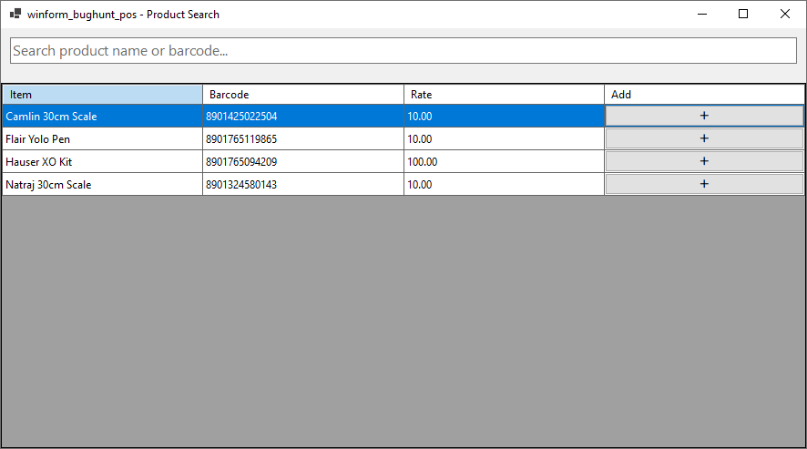

```csharp
using MySql.Data.MySqlClient;
using System;
using System.Collections.Generic;
using System.ComponentModel;
using System.Data;
using System.Drawing;
using System.Text;
using System.Windows.Forms;
using winform_bughunt_pos.UI.Controls;

namespace winform_bughunt_pos
{
    public partial class ProductForm : Form
    {
        private DataGridView dgvProducts;
        private TextBox txtSearch;
        private DBHelper db = new DBHelper();

        public string SelectedBarcode { get; private set; }

        public ProductForm()
        {
            InitializeComponent();
            AppConfig.ApplyFormTitle(this, "Product Search");

            this.Size = new Size(900, 500);
            this.StartPosition = FormStartPosition.CenterScreen;

            CreateLayout();
            LoadProducts();
        }

        private void CreateLayout()
        {
            Panel topPanel = new Panel()
            {
                Dock = DockStyle.Top,
                Height = 60,
                Padding = new Padding(10)
            };

            txtSearch = new TextBox()
            {
                Dock = DockStyle.Fill,
                Font = new Font("Segoe UI", 12),
                PlaceholderText = "Search product name or barcode..."
            };

            txtSearch.TextChanged += TxtSearch_TextChanged;

            topPanel.Controls.Add(txtSearch);

            dgvProducts = new DataGridView()
            {
                Dock = DockStyle.Fill,
                AllowUserToAddRows = false,
                RowHeadersVisible = false,
                AutoSizeColumnsMode = DataGridViewAutoSizeColumnsMode.Fill,
                SelectionMode = DataGridViewSelectionMode.FullRowSelect,
                MultiSelect = false
            };

            dgvProducts.Columns.Add("Product", "Item");
            dgvProducts.Columns.Add("Barcode", "Barcode");
            dgvProducts.Columns.Add("Rate", "Rate");

            DataGridViewButtonColumn btnAdd = new DataGridViewButtonColumn();
            btnAdd.HeaderText = "Add";
            btnAdd.Text = "➕";
            btnAdd.UseColumnTextForButtonValue = true;
            dgvProducts.Columns.Add(btnAdd);

            dgvProducts.CellClick += DgvProducts_CellClick;
            dgvProducts.CellDoubleClick += DgvProducts_CellDoubleClick;

            this.Controls.Add(dgvProducts);
            this.Controls.Add(topPanel);
        }

        private void LoadProducts(string keyword = "")
        {
            dgvProducts.Rows.Clear();

            string query = @"SELECT product_name, barcode, retail_rate, wholesale_rate 
                             FROM products
                             WHERE product_name LIKE @key 
                                OR barcode LIKE @key
                             ORDER BY product_name";

            MySqlParameter[] param =
            {
                new MySqlParameter("@key", "%" + keyword + "%")
            };

            DataTable dt = db.ExecuteDataTable(query, param);

            foreach (DataRow row in dt.Rows)
            {
                decimal retail = Convert.ToDecimal(row["retail_rate"]);
                decimal wholesale = Convert.ToDecimal(row["wholesale_rate"]);

                decimal selectedRate = POSSession.SelectedRate == RateToggleControl.RateType.Retail ? retail : wholesale;

                dgvProducts.Rows.Add(
                    row["product_name"],
                    row["barcode"],
                    selectedRate
                );
            }
        }

        private void TxtSearch_TextChanged(object sender, EventArgs e)
        {
            LoadProducts(txtSearch.Text.Trim());
        }

        private void DgvProducts_CellClick(object sender, DataGridViewCellEventArgs e)
        {
            if (e.RowIndex < 0)
                return;

            if (dgvProducts.Columns[e.ColumnIndex] is DataGridViewButtonColumn)
            {
                SelectProduct(e.RowIndex);
            }
        }

        private void DgvProducts_CellDoubleClick(object sender, DataGridViewCellEventArgs e)
        {
            if (e.RowIndex < 0)
                return;

            SelectProduct(e.RowIndex);
        }

        private void SelectProduct(int rowIndex)
        {
            SelectedBarcode = dgvProducts.Rows[rowIndex].Cells["Barcode"].Value.ToString();
            this.DialogResult = DialogResult.OK;
            this.Close();
        }
    }
}
```
