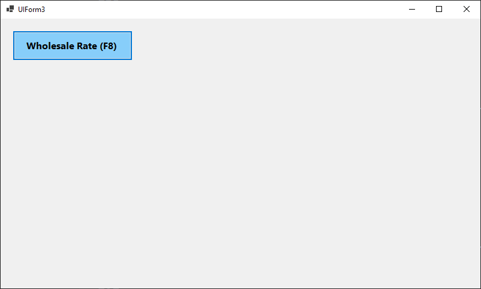
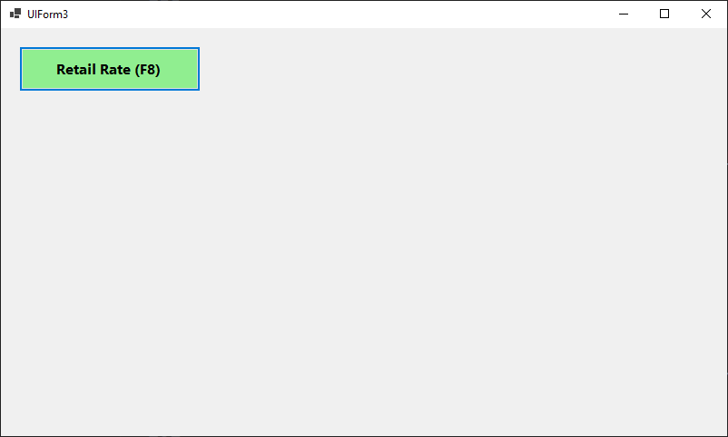

Perfect 👍 You’re using `winform_bughunt_pos.UI.Controls`.

Below is the **complete working solution**:

* ✅ Custom `RateToggleControl`
* ✅ F8 key toggle
* ✅ Click toggle
* ✅ Event handling
* ✅ Ready for POS integration

---

# ✅ 1️⃣ Create Custom Control

📁 `UI/Controls/RateToggleControl.cs`

```csharp
using System;
using System.Drawing;
using System.Windows.Forms;

namespace winform_bughunt_pos.UI.Controls
{
    public partial class RateToggleControl : UserControl
    {
        public enum RateType
        {
            Retail,
            Wholesale
        }

        public RateType CurrentRate { get; private set; } = RateType.Retail;

        public event EventHandler RateChanged;

        private Button btnRate;

        public RateToggleControl()
        {
            InitializeComponent();
            InitializeUI();
            UpdateUI();
        }

        private void InitializeUI()
        {
            btnRate = new Button();
            btnRate.Dock = DockStyle.Fill;
            btnRate.FlatStyle = FlatStyle.Flat;
            btnRate.Font = new Font("Segoe UI", 11, FontStyle.Bold);
            btnRate.Click += (s, e) => ToggleRate();

            this.Controls.Add(btnRate);
        }

        public void ToggleRate()
        {
            CurrentRate = CurrentRate == RateType.Retail
                ? RateType.Wholesale
                : RateType.Retail;

            UpdateUI();
            RateChanged?.Invoke(this, EventArgs.Empty);
        }

        private void UpdateUI()
        {
            if (CurrentRate == RateType.Retail)
            {
                btnRate.Text = "Retail Rate (F8)";
                btnRate.BackColor = Color.LightGreen;
                btnRate.ForeColor = Color.Black;
            }
            else
            {
                btnRate.Text = "Wholesale Rate (F8)";
                btnRate.BackColor = Color.LightSkyBlue;
                btnRate.ForeColor = Color.Black;
            }
        }
    }
}
```

---

# ✅ 2️⃣ UIForm3 Full Working Code

📁 `UIForm3.cs`

```csharp
using System;
using System.Windows.Forms;
using winform_bughunt_pos.UI.Controls;

namespace winform_bughunt_pos
{
    public partial class UIForm3 : Form
    {
        private RateToggleControl rateToggleControl1;

        public UIForm3()
        {
            InitializeComponent();
            InitializeRateControl();

            this.KeyPreview = true;
            this.KeyDown += UIForm3_KeyDown;
        }

        private void InitializeRateControl()
        {
            rateToggleControl1 = new RateToggleControl();
            rateToggleControl1.Width = 200;
            rateToggleControl1.Height = 50;
            rateToggleControl1.Top = 20;
            rateToggleControl1.Left = 20;

            rateToggleControl1.RateChanged += RateToggleControl1_RateChanged;

            this.Controls.Add(rateToggleControl1);
        }

        private void UIForm3_KeyDown(object sender, KeyEventArgs e)
        {
            if (e.KeyCode == Keys.F8)
            {
                rateToggleControl1.ToggleRate();
            }
        }

        private void RateToggleControl1_RateChanged(object sender, EventArgs e)
        {
            if (rateToggleControl1.CurrentRate == RateToggleControl.RateType.Retail)
            {
                MessageBox.Show("Retail Price Activated");
                // TODO: Apply Retail price logic here
            }
            else
            {
                MessageBox.Show("Wholesale Price Activated");
                // TODO: Apply Wholesale price logic here
            }
        }
    }
}
```

---

# 🎯 How It Works

| Action       | Result                    |
| ------------ | ------------------------- |
| Press **F8** | Toggle Retail ↔ Wholesale |
| Click Button | Toggle Retail ↔ Wholesale |
| Event Fires  | You apply price logic     |

---

# 💰 How To Apply To DataGridView (Real POS Example)

Inside `RateToggleControl1_RateChanged`:

```csharp
foreach (DataGridViewRow row in dgvSales.Rows)
{
    if (row.Cells["ProductId"].Value != null)
    {
        decimal retail = Convert.ToDecimal(row.Cells["RetailPrice"].Value);
        decimal wholesale = Convert.ToDecimal(row.Cells["WholesalePrice"].Value);

        row.Cells["Rate"].Value =
            rateToggleControl1.CurrentRate == RateToggleControl.RateType.Retail
            ? retail
            : wholesale;
    }
}
```

---

# 🚀 Professional POS Tip

If you're building a serious POS like your previous modules:

Create a global state:

```csharp
public static class POSSession
{
    public static RateToggleControl.RateType SelectedRate 
        = RateToggleControl.RateType.Retail;
}
```

Then update it inside event:

```csharp
POSSession.SelectedRate = rateToggleControl1.CurrentRate;
```

Then use while adding products.

---

If you want next level upgrade I can give:

* 🔥 Modern flat POS button (rounded corners)
* 🎨 Animated toggle switch style
* 💾 Save selected rate in config.ini (like your printer config)
* 🧠 Auto apply rate when product scanned
* ⚡ Performance optimized grid refresh

Tell me what level you want 😎


