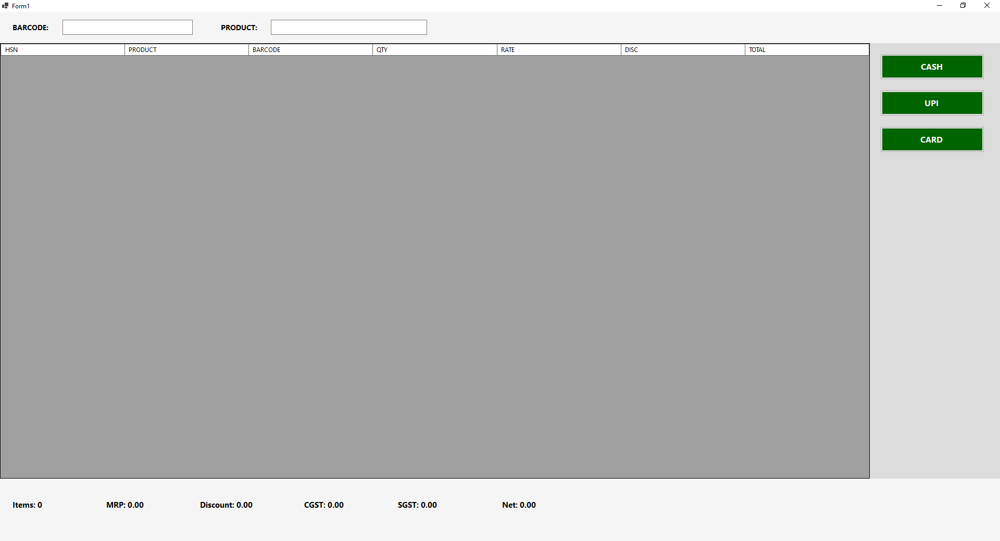

```csharp
using MySql.Data.MySqlClient;
using System;
using System.Data;
using System.Drawing;
using System.Linq;
using System.Windows.Forms;

namespace pos
{
    public partial class Form1 : Form
    {
        private DataGridView dgvPOS;
        private TextBox txtBarcodeSearch;
        private TextBox txtProductSearch;

        private Label lblTotalItems;
        private Label lblMRP;
        private Label lblDiscount;
        private Label lblCGST;
        private Label lblSGST;
        private Label lblNetAmount;

        private Panel paymentPanel;
        private Panel mainPanel;
        private Panel gridPanel;

        private DBHelper db = new DBHelper();

        public Form1()
        {
            InitializeComponent();
            this.WindowState = FormWindowState.Maximized;
            this.KeyPreview = true;

            CreateMainLayout();
            FocusBarcode();
        }

        protected override void OnFormClosing(FormClosingEventArgs e)
        {
            Application.Exit();
            base.OnFormClosing(e);
        }

        // =============================
        // MAIN LAYOUT
        // =============================
        private void CreateMainLayout()
        {
            mainPanel = new Panel();
            mainPanel.Dock = DockStyle.Fill;
            this.Controls.Add(mainPanel);

            Panel topPanel = CreateTopSearchPanel();
            Panel payment = CreatePaymentPanel();
            Panel footer = CreateFooterPanel();

            // 🔥 IMPORTANT: Add Fill panel FIRST
            gridPanel = new Panel();
            gridPanel.Dock = DockStyle.Fill;
            mainPanel.Controls.Add(gridPanel);

            // Then add docked panels
            mainPanel.Controls.Add(payment);   // Right
            mainPanel.Controls.Add(footer);    // Bottom
            mainPanel.Controls.Add(topPanel);  // Top

            InitializePOSGrid();
            dgvPOS.Dock = DockStyle.Fill;
            gridPanel.Controls.Add(dgvPOS);
        }

        // =============================
        // TOP SEARCH PANEL
        // =============================
        private Panel CreateTopSearchPanel()
        {
            Panel topPanel = new Panel();
            topPanel.Dock = DockStyle.Top;
            topPanel.Height = 60;
            topPanel.BackColor = Color.WhiteSmoke;

            Label lblBarcode = new Label()
            {
                Text = "BARCODE:",
                Location = new Point(20, 20),
                AutoSize = true,
                Font = new Font("Segoe UI", 10, FontStyle.Bold)
            };

            txtBarcodeSearch = new TextBox()
            {
                Location = new Point(120, 15),
                Width = 250,
                Font = new Font("Segoe UI", 12)
            };

            txtBarcodeSearch.KeyDown += TxtBarcodeSearch_KeyDown;

            Label lblProduct = new Label()
            {
                Text = "PRODUCT:",
                Location = new Point(420, 20),
                AutoSize = true,
                Font = new Font("Segoe UI", 10, FontStyle.Bold)
            };

            txtProductSearch = new TextBox()
            {
                Location = new Point(520, 15),
                Width = 300,
                Font = new Font("Segoe UI", 12)
            };

            topPanel.Controls.Add(lblBarcode);
            topPanel.Controls.Add(txtBarcodeSearch);
            topPanel.Controls.Add(lblProduct);
            topPanel.Controls.Add(txtProductSearch);

            return topPanel;
        }

        // =============================
        // GRID
        // =============================
        private void InitializePOSGrid()
        {
            dgvPOS = new DataGridView();
            dgvPOS.AllowUserToAddRows = false;
            dgvPOS.RowHeadersVisible = false;
            dgvPOS.SelectionMode = DataGridViewSelectionMode.FullRowSelect;
            dgvPOS.AutoSizeColumnsMode = DataGridViewAutoSizeColumnsMode.Fill;

            dgvPOS.Columns.Add("HSN", "HSN");
            dgvPOS.Columns.Add("Product", "PRODUCT");
            dgvPOS.Columns.Add("Barcode", "BARCODE");
            dgvPOS.Columns.Add("Qty", "QTY");
            dgvPOS.Columns.Add("Rate", "RATE");
            dgvPOS.Columns.Add("Disc", "DISC");
            dgvPOS.Columns.Add("Total", "TOTAL");
            dgvPOS.Columns.Add("GST", "GST%");
            dgvPOS.Columns["GST"].Visible = false;

            dgvPOS.KeyDown += DgvPOS_KeyDown;
        }

        // =============================
        // FOOTER
        // =============================
        private Panel CreateFooterPanel()
        {
            Panel footer = new Panel();
            footer.Dock = DockStyle.Bottom;
            footer.Height = 120;
            footer.BackColor = Color.WhiteSmoke;

            lblTotalItems = CreateFooterLabel("Items: 0", 20);
            lblMRP = CreateFooterLabel("MRP: 0.00", 200);
            lblDiscount = CreateFooterLabel("Discount: 0.00", 380);
            lblCGST = CreateFooterLabel("CGST: 0.00", 580);
            lblSGST = CreateFooterLabel("SGST: 0.00", 760);
            lblNetAmount = CreateFooterLabel("Net: 0.00", 960);

            footer.Controls.Add(lblTotalItems);
            footer.Controls.Add(lblMRP);
            footer.Controls.Add(lblDiscount);
            footer.Controls.Add(lblCGST);
            footer.Controls.Add(lblSGST);
            footer.Controls.Add(lblNetAmount);

            return footer;
        }

        private Label CreateFooterLabel(string text, int x)
        {
            return new Label()
            {
                Text = text,
                Location = new Point(x, 40),
                AutoSize = true,
                Font = new Font("Segoe UI", 11, FontStyle.Bold)
            };
        }

        // =============================
        // PAYMENT PANEL
        // =============================
        private Panel CreatePaymentPanel()
        {
            paymentPanel = new Panel();
            paymentPanel.Dock = DockStyle.Right;
            paymentPanel.Width = 250;
            paymentPanel.BackColor = Color.Gainsboro;

            Button btnCash = CreatePayButton("CASH", 20);
            Button btnUPI = CreatePayButton("UPI", 90);
            Button btnCard = CreatePayButton("CARD", 160);

            paymentPanel.Controls.Add(btnCash);
            paymentPanel.Controls.Add(btnUPI);
            paymentPanel.Controls.Add(btnCard);

            return paymentPanel;
        }

        private Button CreatePayButton(string text, int top)
        {
            return new Button()
            {
                Text = text,
                Width = 200,
                Height = 50,
                Top = top,
                Left = 20,
                Font = new Font("Segoe UI", 12, FontStyle.Bold),
                BackColor = Color.DarkGreen,
                ForeColor = Color.White
            };
        }

        // =============================
        // BARCODE SCAN
        // =============================
        private void TxtBarcodeSearch_KeyDown(object sender, KeyEventArgs e)
        {
            if (e.KeyCode == Keys.Enter)
            {
                AddOrIncreaseProduct(txtBarcodeSearch.Text.Trim());
                txtBarcodeSearch.Clear();
                FocusBarcode();
            }
        }

        private void AddOrIncreaseProduct(string barcode)
        {
            if (string.IsNullOrWhiteSpace(barcode))
                return;

            // 🔹 Check if product already exists in grid
            foreach (DataGridViewRow row in dgvPOS.Rows)
            {
                if (row.Cells["Barcode"].Value.ToString() == barcode)
                {
                    int qty = Convert.ToInt32(row.Cells["Qty"].Value);
                    qty++;
                    row.Cells["Qty"].Value = qty;

                    UpdateRow(row);
                    CalculateSummary();
                    return;
                }
            }

            // 🔹 Fetch product from database using DBHelper
            string query = "SELECT hsn, product_name, rate, gst_percent FROM products WHERE barcode = @barcode";

            MySqlParameter[] parameters =
            {
                new MySqlParameter("@barcode", barcode)
            };

            DataTable dt = db.ExecuteDataTable(query, parameters);

            if (dt.Rows.Count > 0)
            {
                DataRow dr = dt.Rows[0];

                string hsn = dr["hsn"].ToString();
                string productName = dr["product_name"].ToString();
                decimal rate = Convert.ToDecimal(dr["rate"]);
                decimal gst = Convert.ToDecimal(dr["gst_percent"]);

                dgvPOS.Rows.Add(hsn, productName, barcode, 1, rate, 0, rate, gst);

                CalculateSummary();
            }
            else
            {
                MessageBox.Show("Product Not Found!", "Warning", MessageBoxButtons.OK, MessageBoxIcon.Warning);
            }
        }


        // =============================
        // UPDATE ROW
        // =============================
        private void UpdateRow(DataGridViewRow row)
        {
            decimal qty = Convert.ToDecimal(row.Cells["Qty"].Value);
            decimal rate = Convert.ToDecimal(row.Cells["Rate"].Value);
            decimal disc = Convert.ToDecimal(row.Cells["Disc"].Value);

            decimal total = (qty * rate) - disc;
            row.Cells["Total"].Value = total;
        }

        // =============================
        // DELETE + F2
        // =============================
        private void DgvPOS_KeyDown(object sender, KeyEventArgs e)
        {
            if (e.KeyCode == Keys.Delete && dgvPOS.SelectedRows.Count > 0)
            {
                dgvPOS.Rows.RemoveAt(dgvPOS.SelectedRows[0].Index);
                CalculateSummary();
            }

            if (e.KeyCode == Keys.F2 && dgvPOS.SelectedRows.Count > 0)
            {
                DataGridViewRow row = dgvPOS.SelectedRows[0];
                string input = Microsoft.VisualBasic.Interaction.InputBox("Enter Qty", "Edit Qty", row.Cells["Qty"].Value.ToString());

                if (int.TryParse(input, out int newQty))
                {
                    row.Cells["Qty"].Value = newQty;
                    UpdateRow(row);
                    CalculateSummary();
                }

                FocusBarcode();
            }
        }

        // =============================
        // SUMMARY
        // =============================
        private void CalculateSummary()
        {
            int totalItems = dgvPOS.Rows.Count;
            decimal mrp = 0;
            decimal discount = 0;
            decimal totalGST = 0;

            foreach (DataGridViewRow row in dgvPOS.Rows)
            {
                decimal qty = Convert.ToDecimal(row.Cells["Qty"].Value);
                decimal rate = Convert.ToDecimal(row.Cells["Rate"].Value);
                decimal disc = Convert.ToDecimal(row.Cells["Disc"].Value);
                decimal gstPercent = Convert.ToDecimal(row.Cells["GST"].Value);

                decimal lineTotal = (qty * rate) - disc;

                mrp += qty * rate;
                discount += disc;
                totalGST += lineTotal * gstPercent / 100;
            }

            decimal cgst = totalGST / 2;
            decimal sgst = totalGST / 2;
            decimal net = (mrp - discount) + totalGST;

            lblTotalItems.Text = $"Items: {totalItems}";
            lblMRP.Text = $"MRP: {mrp:0.00}";
            lblDiscount.Text = $"Discount: {discount:0.00}";
            lblCGST.Text = $"CGST: {cgst:0.00}";
            lblSGST.Text = $"SGST: {sgst:0.00}";
            lblNetAmount.Text = $"Net: {net:0.00}";
        }

        private void FocusBarcode()
        {
            txtBarcodeSearch.Focus();
        }

        private void Form1_Load(object sender, EventArgs e)
        {

        }
    }
}
```

