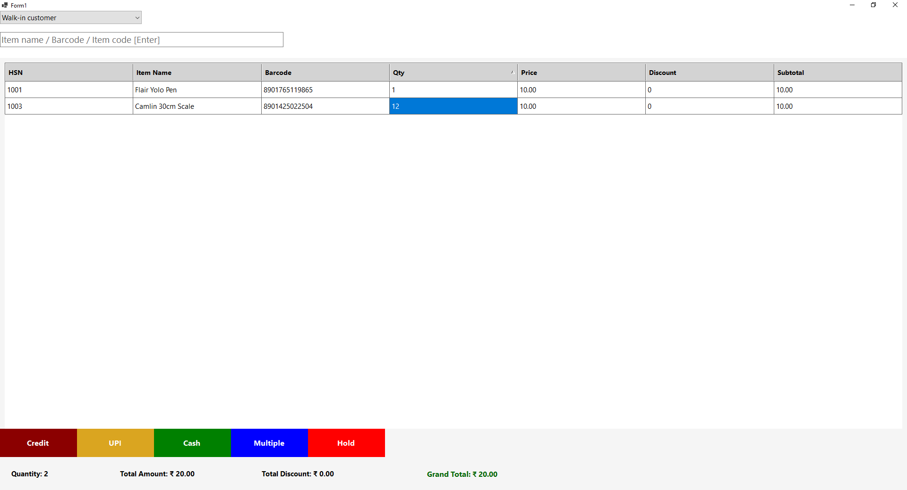

```csharp
using MySql.Data.MySqlClient;
using System;
using System.Data;
using System.Drawing;
using System.Windows.Forms;

namespace pos
{
    public partial class Form1 : Form
    {
        private DataGridView dgvPOS;
        private TextBox txtSearch;

        private Label lblQty;
        private Label lblTotal;
        private Label lblDiscount;
        private Label lblGrand;

        private Panel mainPanel;
        private Panel gridPanel;

        private DBHelper db = new DBHelper();

        public Form1()
        {
            InitializeComponent();
            this.WindowState = FormWindowState.Maximized;
            this.KeyPreview = true;

            CreateMainLayout();
        }

        protected override void OnFormClosing(FormClosingEventArgs e)
        {
            Application.Exit();
            base.OnFormClosing(e);
        }

        // ==============================
        // MAIN LAYOUT
        // ==============================
        private void CreateMainLayout()
        {
            mainPanel = new Panel();
            mainPanel.Dock = DockStyle.Fill;
            mainPanel.BackColor = Color.FromArgb(245, 245, 245);
            this.Controls.Add(mainPanel);

            Panel topPanel = CreateTopPanel();
            Panel summaryPanel = CreateSummaryPanel();
            Panel buttonPanel = CreateBottomButtons();

            gridPanel = new Panel();
            gridPanel.Dock = DockStyle.Fill;
            gridPanel.Padding = new Padding(10);

            InitializeGrid();
            dgvPOS.Dock = DockStyle.Fill;
            gridPanel.Controls.Add(dgvPOS);

            mainPanel.Controls.Add(buttonPanel);
            mainPanel.Controls.Add(summaryPanel);
            mainPanel.Controls.Add(gridPanel);
            mainPanel.Controls.Add(topPanel);
        }

        // ==============================
        // TOP PANEL
        // ==============================
        private Panel CreateTopPanel()
        {
            Panel panel = new Panel();
            panel.Dock = DockStyle.Top;
            panel.Height = 100;
            panel.Padding = new Padding(15);
            panel.BackColor = Color.White;

            ComboBox cmbCustomer = new ComboBox()
            {
                Width = 300,
                Font = new Font("Segoe UI", 11),
                DropDownStyle = ComboBoxStyle.DropDownList
            };
            cmbCustomer.Items.Add("Walk-in customer");
            cmbCustomer.SelectedIndex = 0;

            txtSearch = new TextBox()
            {
                Top = 45,
                Width = 600,
                Font = new Font("Segoe UI", 14),
                PlaceholderText = "Item name / Barcode / Item code [Enter]"
            };
            txtSearch.KeyDown += TxtSearch_KeyDown;

            panel.Controls.Add(cmbCustomer);
            panel.Controls.Add(txtSearch);

            return panel;
        }

        // ==============================
        // GRID
        // ==============================
        private void InitializeGrid()
        {
            dgvPOS = new DataGridView();
            dgvPOS.AllowUserToAddRows = false;
            dgvPOS.RowHeadersVisible = false;
            dgvPOS.BackgroundColor = Color.White;
            dgvPOS.BorderStyle = BorderStyle.None;
            dgvPOS.AutoSizeColumnsMode = DataGridViewAutoSizeColumnsMode.Fill;
            dgvPOS.ColumnHeadersHeight = 40;

            dgvPOS.EnableHeadersVisualStyles = false;
            dgvPOS.ColumnHeadersDefaultCellStyle.BackColor = Color.LightGray;
            dgvPOS.ColumnHeadersDefaultCellStyle.Font = new Font("Segoe UI", 10, FontStyle.Bold);

            dgvPOS.DefaultCellStyle.Font = new Font("Segoe UI", 11);
            dgvPOS.RowTemplate.Height = 35;

            dgvPOS.Columns.Add("HSN", "HSN");
            dgvPOS.Columns.Add("Product", "Item Name");
            dgvPOS.Columns.Add("Barcode", "Barcode");
            dgvPOS.Columns.Add("Qty", "Qty");
            dgvPOS.Columns.Add("Rate", "Price");
            dgvPOS.Columns.Add("Disc", "Discount");
            dgvPOS.Columns.Add("Total", "Subtotal");
            dgvPOS.Columns.Add("GST", "GST%");
            dgvPOS.Columns["GST"].Visible = false;

            dgvPOS.KeyDown += DgvPOS_KeyDown;
        }

        // ==============================
        // SUMMARY PANEL
        // ==============================
        private Panel CreateSummaryPanel()
        {
            Panel panel = new Panel();
            panel.Dock = DockStyle.Bottom;
            panel.Height = 70;
            panel.BackColor = Color.WhiteSmoke;

            lblQty = CreateLabel("Quantity: 0", 20);
            lblTotal = CreateLabel("Total Amount: ₹ 0.00", 250);
            lblDiscount = CreateLabel("Total Discount: ₹ 0.00", 550);

            lblGrand = new Label()
            {
                Text = "Grand Total: ₹ 0.00",
                Left = 900,
                Top = 25,
                AutoSize = true,
                Font = new Font("Segoe UI", 12, FontStyle.Bold),
                ForeColor = Color.DarkGreen
            };

            panel.Controls.Add(lblQty);
            panel.Controls.Add(lblTotal);
            panel.Controls.Add(lblDiscount);
            panel.Controls.Add(lblGrand);

            return panel;
        }

        private Label CreateLabel(string text, int left)
        {
            return new Label()
            {
                Text = text,
                Left = left,
                Top = 25,
                AutoSize = true,
                Font = new Font("Segoe UI", 11, FontStyle.Bold)
            };
        }

        // ==============================
        // BOTTOM BUTTONS
        // ==============================
        private Panel CreateBottomButtons()
        {
            Panel panel = new Panel();
            panel.Dock = DockStyle.Bottom;
            panel.Height = 60;

            panel.Controls.Add(CreateButton("Hold", Color.Red));
            panel.Controls.Add(CreateButton("Multiple", Color.Blue));
            panel.Controls.Add(CreateButton("Cash", Color.Green));
            panel.Controls.Add(CreateButton("UPI", Color.Goldenrod));
            panel.Controls.Add(CreateButton("Credit", Color.DarkRed));

            return panel;
        }

        private Button CreateButton(string text, Color color)
        {
            Button btn = new Button();
            btn.Text = text;
            btn.Dock = DockStyle.Left;
            btn.Width = this.Width / 5;
            btn.Font = new Font("Segoe UI", 12, FontStyle.Bold);
            btn.BackColor = color;
            btn.ForeColor = Color.White;
            btn.FlatStyle = FlatStyle.Flat;
            btn.FlatAppearance.BorderSize = 0;
            return btn;
        }

        // ==============================
        // BARCODE SEARCH
        // ==============================
        private void TxtSearch_KeyDown(object sender, KeyEventArgs e)
        {
            if (e.KeyCode == Keys.Enter)
            {
                AddOrIncreaseProduct(txtSearch.Text.Trim());
                txtSearch.Clear();
            }
        }

        private void AddOrIncreaseProduct(string barcode)
        {
            if (string.IsNullOrWhiteSpace(barcode))
                return;

            foreach (DataGridViewRow row in dgvPOS.Rows)
            {
                if (row.Cells["Barcode"].Value?.ToString() == barcode)
                {
                    int qty = Convert.ToInt32(row.Cells["Qty"].Value);
                    row.Cells["Qty"].Value = qty + 1;
                    UpdateRow(row);
                    CalculateSummary();
                    return;
                }
            }

            string query = "SELECT hsn, product_name, rate, gst_percent FROM products WHERE barcode=@barcode";

            MySqlParameter[] parameters =
            {
                new MySqlParameter("@barcode", barcode)
            };

            DataTable dt = db.ExecuteDataTable(query, parameters);

            if (dt.Rows.Count > 0)
            {
                DataRow dr = dt.Rows[0];

                dgvPOS.Rows.Add(
                    dr["hsn"],
                    dr["product_name"],
                    barcode,
                    1,
                    dr["rate"],
                    0,
                    dr["rate"],
                    dr["gst_percent"]
                );

                CalculateSummary();
            }
            else
            {
                MessageBox.Show("Product Not Found!");
            }
        }

        // ==============================
        // UPDATE ROW
        // ==============================
        private void UpdateRow(DataGridViewRow row)
        {
            decimal qty = Convert.ToDecimal(row.Cells["Qty"].Value);
            decimal rate = Convert.ToDecimal(row.Cells["Rate"].Value);
            decimal disc = Convert.ToDecimal(row.Cells["Disc"].Value);

            decimal total = (qty * rate) - disc;
            row.Cells["Total"].Value = total;
        }

        // ==============================
        // DELETE + EDIT
        // ==============================
        private void DgvPOS_KeyDown(object sender, KeyEventArgs e)
        {
            if (e.KeyCode == Keys.Delete && dgvPOS.SelectedRows.Count > 0)
            {
                dgvPOS.Rows.RemoveAt(dgvPOS.SelectedRows[0].Index);
                CalculateSummary();
            }

            if (e.KeyCode == Keys.F2 && dgvPOS.SelectedRows.Count > 0)
            {
                DataGridViewRow row = dgvPOS.SelectedRows[0];
                string input = Microsoft.VisualBasic.Interaction.InputBox("Enter Qty", "Edit Qty", row.Cells["Qty"].Value.ToString());

                if (int.TryParse(input, out int newQty))
                {
                    row.Cells["Qty"].Value = newQty;
                    UpdateRow(row);
                    CalculateSummary();
                }
            }
        }

        // ==============================
        // CALCULATE SUMMARY
        // ==============================
        private void CalculateSummary()
        {
            int totalItems = dgvPOS.Rows.Count;
            decimal totalAmount = 0;
            decimal discount = 0;

            foreach (DataGridViewRow row in dgvPOS.Rows)
            {
                decimal qty = Convert.ToDecimal(row.Cells["Qty"].Value);
                decimal rate = Convert.ToDecimal(row.Cells["Rate"].Value);
                decimal disc = Convert.ToDecimal(row.Cells["Disc"].Value);

                totalAmount += qty * rate;
                discount += disc;
            }

            decimal grand = totalAmount - discount;

            lblQty.Text = $"Quantity: {totalItems}";
            lblTotal.Text = $"Total Amount: ₹ {totalAmount:0.00}";
            lblDiscount.Text = $"Total Discount: ₹ {discount:0.00}";
            lblGrand.Text = $"Grand Total: ₹ {grand:0.00}";
        }

        private void Form1_Load(object sender, EventArgs e)
        {

        }
    }
}
```
