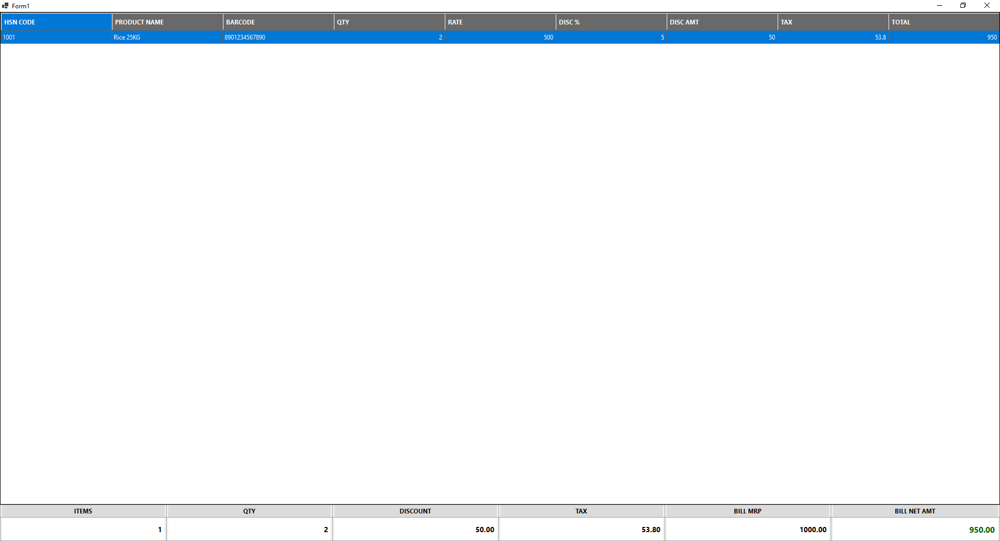

```csharp
using System;
using System.Drawing;
using System.IO;
using System.Windows.Forms;
using IniParser;
using IniParser.Model;

namespace pos
{
    public partial class Form1 : Form
    {
        private DataGridView dgvPOS;

        private TableLayoutPanel footerTable;
        private Label lblItemsVal, lblQtyVal, lblDiscVal,
                      lblTaxVal, lblMRPVal, lblNetVal;

        public Form1()
        {
            InitializeComponent();

            this.WindowState = FormWindowState.Maximized;
            this.KeyPreview = true;

            InitializePOSGrid();
            CreateProfessionalFooter();

            // Sample Row
            dgvPOS.Rows.Add("1001", "Rice 25KG", "8901234567890",
                2, 500, 5, 50, 53.80, 950);

            CalculateSummary();
        }

        protected override void OnFormClosing(FormClosingEventArgs e)
        {
            Application.Exit();
            base.OnFormClosing(e);
        }

        #region GRID

        private void InitializePOSGrid()
        {
            dgvPOS = new DataGridView();
            dgvPOS.Dock = DockStyle.Fill;
            dgvPOS.AllowUserToAddRows = false;
            dgvPOS.RowHeadersVisible = false;
            dgvPOS.AutoSizeColumnsMode = DataGridViewAutoSizeColumnsMode.Fill;
            dgvPOS.SelectionMode = DataGridViewSelectionMode.FullRowSelect;
            dgvPOS.BackgroundColor = Color.White;

            dgvPOS.EnableHeadersVisualStyles = false;
            dgvPOS.ColumnHeadersDefaultCellStyle.BackColor = Color.DimGray;
            dgvPOS.ColumnHeadersDefaultCellStyle.ForeColor = Color.White;
            dgvPOS.ColumnHeadersDefaultCellStyle.Font =
                new Font("Segoe UI", 9, FontStyle.Bold);
            dgvPOS.ColumnHeadersHeight = 35;

            dgvPOS.DefaultCellStyle.Font =
                new Font("Segoe UI", 9);

            // Columns
            dgvPOS.Columns.Add("HSN", "HSN CODE");
            dgvPOS.Columns.Add("Product", "PRODUCT NAME");
            dgvPOS.Columns.Add("Barcode", "BARCODE");
            dgvPOS.Columns.Add("Qty", "QTY");
            dgvPOS.Columns.Add("Rate", "RATE");
            dgvPOS.Columns.Add("DiscPercent", "DISC %");
            dgvPOS.Columns.Add("DiscAmount", "DISC AMT");
            dgvPOS.Columns.Add("Tax", "TAX");
            dgvPOS.Columns.Add("Total", "TOTAL");

            // Align numeric columns right
            string[] numericCols =
                { "Qty", "Rate", "DiscPercent",
                  "DiscAmount", "Tax", "Total" };

            foreach (var col in numericCols)
                dgvPOS.Columns[col].DefaultCellStyle.Alignment =
                    DataGridViewContentAlignment.MiddleRight;

            dgvPOS.CellValueChanged += (s, e) => CalculateSummary();
            dgvPOS.RowsAdded += (s, e) => CalculateSummary();
            dgvPOS.RowsRemoved += (s, e) => CalculateSummary();

            this.Controls.Add(dgvPOS);
        }

        #endregion

        #region FOOTER

        private void CreateProfessionalFooter()
        {
            footerTable = new TableLayoutPanel();
            footerTable.Dock = DockStyle.Bottom;
            footerTable.Height = 70;
            footerTable.ColumnCount = 6;
            footerTable.RowCount = 2;
            footerTable.CellBorderStyle =
                TableLayoutPanelCellBorderStyle.Single;

            for (int i = 0; i < 6; i++)
                footerTable.ColumnStyles.Add(
                    new ColumnStyle(SizeType.Percent, 16.66f));

            string[] headers =
            {
                "ITEMS", "QTY", "DISCOUNT",
                "TAX", "BILL MRP", "BILL NET AMT"
            };

            for (int i = 0; i < headers.Length; i++)
            {
                Label header = new Label
                {
                    Text = headers[i],
                    Dock = DockStyle.Fill,
                    TextAlign = ContentAlignment.MiddleCenter,
                    BackColor = Color.Gainsboro,
                    Font = new Font("Segoe UI", 9, FontStyle.Bold)
                };

                footerTable.Controls.Add(header, i, 0);
            }

            lblItemsVal = CreateValueLabel();
            lblQtyVal = CreateValueLabel();
            lblDiscVal = CreateValueLabel();
            lblTaxVal = CreateValueLabel();
            lblMRPVal = CreateValueLabel();
            lblNetVal = CreateValueLabel(true);

            footerTable.Controls.Add(lblItemsVal, 0, 1);
            footerTable.Controls.Add(lblQtyVal, 1, 1);
            footerTable.Controls.Add(lblDiscVal, 2, 1);
            footerTable.Controls.Add(lblTaxVal, 3, 1);
            footerTable.Controls.Add(lblMRPVal, 4, 1);
            footerTable.Controls.Add(lblNetVal, 5, 1);

            this.Controls.Add(footerTable);
        }

        private Label CreateValueLabel(bool isNet = false)
        {
            return new Label
            {
                Text = "0.00",
                Dock = DockStyle.Fill,
                TextAlign = ContentAlignment.MiddleRight,
                BackColor = Color.White,
                Font = isNet
                    ? new Font("Segoe UI", 12, FontStyle.Bold)
                    : new Font("Segoe UI", 10, FontStyle.Bold),
                ForeColor = isNet ? Color.DarkGreen : Color.Black
            };
        }

        #endregion

        #region CALCULATION

        private void CalculateSummary()
        {
            int totalItems = dgvPOS.Rows.Count;
            decimal totalQty = 0;
            decimal totalDiscount = 0;
            decimal totalTax = 0;
            decimal totalMRP = 0;
            decimal totalNet = 0;

            foreach (DataGridViewRow row in dgvPOS.Rows)
            {
                if (row.IsNewRow) continue;

                decimal qty = GetDecimal(row.Cells["Qty"].Value);
                decimal rate = GetDecimal(row.Cells["Rate"].Value);
                decimal disc = GetDecimal(row.Cells["DiscAmount"].Value);
                decimal tax = GetDecimal(row.Cells["Tax"].Value);
                decimal total = GetDecimal(row.Cells["Total"].Value);

                totalQty += qty;
                totalDiscount += disc;
                totalTax += tax;
                totalMRP += qty * rate;
                totalNet += total;
            }

            lblItemsVal.Text = totalItems.ToString();
            lblQtyVal.Text = totalQty.ToString("0.##");
            lblDiscVal.Text = totalDiscount.ToString("0.00");
            lblTaxVal.Text = totalTax.ToString("0.00");
            lblMRPVal.Text = totalMRP.ToString("0.00");
            lblNetVal.Text = totalNet.ToString("0.00");
        }

        private decimal GetDecimal(object value)
        {
            if (value == null) return 0;
            decimal.TryParse(value.ToString(), out decimal result);
            return result;
        }

        #endregion

        private void Form1_Load(object sender, EventArgs e)
        {

        }
    }
}
```

