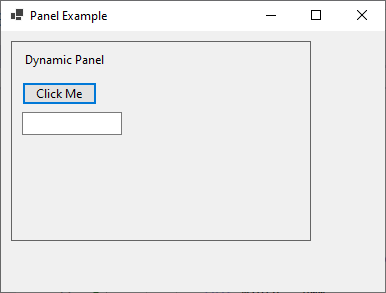
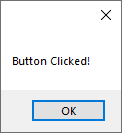

# Panel





`MainForm.cs`

```
namespace HelloWorldApp
{
    public partial class MainForm : Form
    {

        public MainForm()
        {            

            this.Text = "Panel Example";

            this.Width = 400;
            this.Height = 300;

            // Assign the MainForm_Load event handler to the Load event
            this.Load += MainForm_Load;
        }

        private void MainForm_Load(object sender, EventArgs e)
        {
            GeneratePanelWithUI();
        }

        private void GeneratePanelWithUI()
        {
            // Create a new Panel
            Panel dynamicPanel = new Panel();
            dynamicPanel.Location = new Point(10, 10);
            dynamicPanel.Size = new Size(300, 200);
            dynamicPanel.BorderStyle = BorderStyle.FixedSingle;

            // Create UI elements within the Panel
            Label label = new Label();
            label.Text = "Dynamic Panel Example";
            label.Location = new Point(10, 10);

            Button button = new Button();
            button.Text = "Click Me";
            button.Location = new Point(10, 40);
            button.Click += Button_Click;

            TextBox textBox = new TextBox();
            textBox.Location = new Point(10, 70);

            // Add UI elements to the Panel
            dynamicPanel.Controls.Add(label);
            dynamicPanel.Controls.Add(button);
            dynamicPanel.Controls.Add(textBox);

            // Add the Panel to the main Form
            this.Controls.Add(dynamicPanel);
        }

        private void Button_Click(object sender, EventArgs e)
        {
            MessageBox.Show("Button Clicked!");
        }

    }
}
```