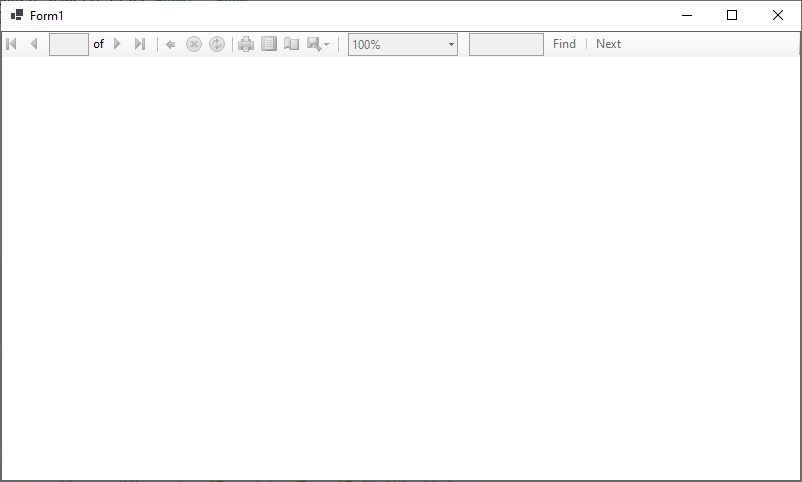

`Form1.cs`

```csharp
using Microsoft.Reporting.WinForms;

namespace WinFormsApp1
{
    public partial class Form1 : Form
    {
        private readonly ReportViewer _reportViewer;

        public Form1()
        {
            InitializeComponent();
            _reportViewer = new ReportViewer();
            _reportViewer.Dock = DockStyle.Fill;
            this.Controls.Add(_reportViewer);
        }        
    }
}
```

