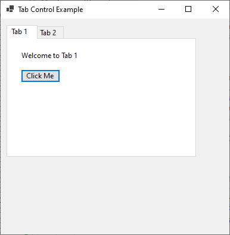
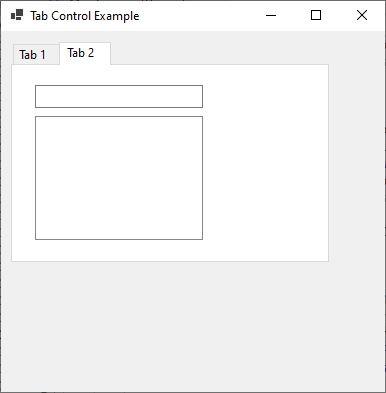

# TabControl





`MainForm.cs`

```
namespace HelloWorldApp
{
    public partial class MainForm : Form
    {
        private TabControl tabControl1;
        private TabPage tabPage1;
        private TabPage tabPage2;
        private Label labelTab1;
        private Button buttonTab1;
        private TextBox textBoxTab2;
        private ListBox listBoxTab2;

        public MainForm()
        {
            InitializeComponent();

            this.Text = "Tab Control Example";

            this.Width = 400;
            this.Height = 400;

            // Assign the MainForm_Load event handler to the Load event
            this.Load += MainForm_Load;
        }

        private void MainForm_Load(object sender, EventArgs e)
        {
            // You can perform additional initialization here if needed
        }

        private void buttonTab1_Click(object sender, EventArgs e)
        {
            MessageBox.Show("Button in Tab 1 was clicked!");
        }

        private void listBoxTab2_SelectedIndexChanged(object sender, EventArgs e)
        {
            string selectedText = listBoxTab2.SelectedItem.ToString();
            MessageBox.Show($"Selected item in Tab 2: {selectedText}");
        }

        private void InitializeComponent()
        {
            this.tabControl1 = new TabControl();
            this.tabPage1 = new TabPage();
            this.tabPage2 = new TabPage();
            this.labelTab1 = new Label();
            this.buttonTab1 = new Button();
            this.textBoxTab2 = new TextBox();
            this.listBoxTab2 = new ListBox();
            this.tabControl1.SuspendLayout();
            this.tabPage1.SuspendLayout();
            this.tabPage2.SuspendLayout();
            this.SuspendLayout();

            // tabControl1
            this.tabControl1.Controls.Add(this.tabPage1);
            this.tabControl1.Controls.Add(this.tabPage2);
            this.tabControl1.Location = new System.Drawing.Point(12, 12);
            this.tabControl1.Name = "tabControl1";
            this.tabControl1.SelectedIndex = 0;
            this.tabControl1.Size = new System.Drawing.Size(366, 236);
            this.tabControl1.TabIndex = 0;

            // tabPage1
            this.tabPage1.Controls.Add(this.buttonTab1);
            this.tabPage1.Controls.Add(this.labelTab1);
            this.tabPage1.Location = new System.Drawing.Point(4, 25);
            this.tabPage1.Name = "tabPage1";
            this.tabPage1.Padding = new Padding(3);
            this.tabPage1.Size = new System.Drawing.Size(358, 207);
            this.tabPage1.TabIndex = 0;
            this.tabPage1.Text = "Tab 1";
            this.tabPage1.UseVisualStyleBackColor = true;

            // tabPage2
            this.tabPage2.Controls.Add(this.listBoxTab2);
            this.tabPage2.Controls.Add(this.textBoxTab2);
            this.tabPage2.Location = new System.Drawing.Point(4, 25);
            this.tabPage2.Name = "tabPage2";
            this.tabPage2.Padding = new Padding(3);
            this.tabPage2.Size = new System.Drawing.Size(358, 207);
            this.tabPage2.TabIndex = 1;
            this.tabPage2.Text = "Tab 2";
            this.tabPage2.UseVisualStyleBackColor = true;

            // labelTab1
            this.labelTab1.AutoSize = true;
            this.labelTab1.Location = new System.Drawing.Point(20, 20);
            this.labelTab1.Name = "labelTab1";
            this.labelTab1.Size = new System.Drawing.Size(98, 17);
            this.labelTab1.TabIndex = 0;
            this.labelTab1.Text = "Welcome to Tab 1";

            // buttonTab1
            this.buttonTab1.Location = new System.Drawing.Point(23, 53);
            this.buttonTab1.Name = "buttonTab1";
            this.buttonTab1.Size = new System.Drawing.Size(75, 23);
            this.buttonTab1.TabIndex = 1;
            this.buttonTab1.Text = "Click Me";
            this.buttonTab1.UseVisualStyleBackColor = true;
            this.buttonTab1.Click += new System.EventHandler(this.buttonTab1_Click);

            // textBoxTab2
            this.textBoxTab2.Location = new System.Drawing.Point(23, 20);
            this.textBoxTab2.Name = "textBoxTab2";
            this.textBoxTab2.Size = new System.Drawing.Size(192, 22);
            this.textBoxTab2.TabIndex = 0;

            // listBoxTab2
            this.listBoxTab2.FormattingEnabled = true;
            this.listBoxTab2.ItemHeight = 16;
            this.listBoxTab2.Location = new System.Drawing.Point(23, 53);
            this.listBoxTab2.Name = "listBoxTab2";
            this.listBoxTab2.Size = new System.Drawing.Size(192, 132);
            this.listBoxTab2.TabIndex = 1;
            this.listBoxTab2.SelectedIndexChanged += new System.EventHandler(this.listBoxTab2_SelectedIndexChanged);

            // Form1
            this.AutoScaleDimensions = new System.Drawing.SizeF(8F, 16F);
            this.AutoScaleMode = AutoScaleMode.Font;
            this.ClientSize = new System.Drawing.Size(390, 260);
            this.Controls.Add(this.tabControl1);            
            this.tabControl1.ResumeLayout(false);
            this.tabPage1.ResumeLayout(false);
            this.tabPage1.PerformLayout();
            this.tabPage2.ResumeLayout(false);
            this.tabPage2.PerformLayout();
            this.ResumeLayout(false);
        }

    }
}
```