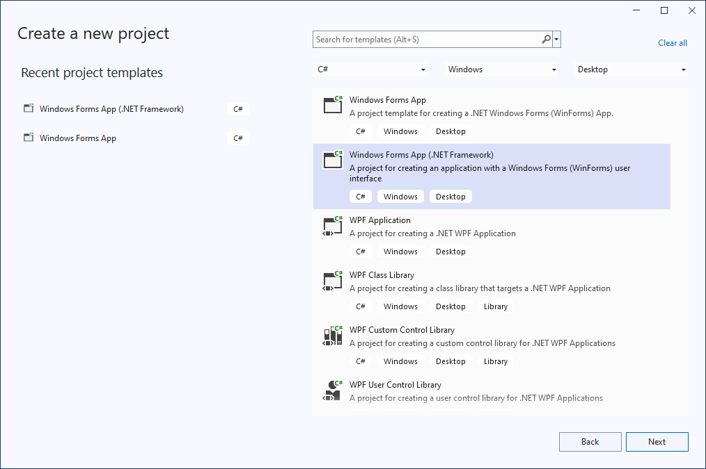
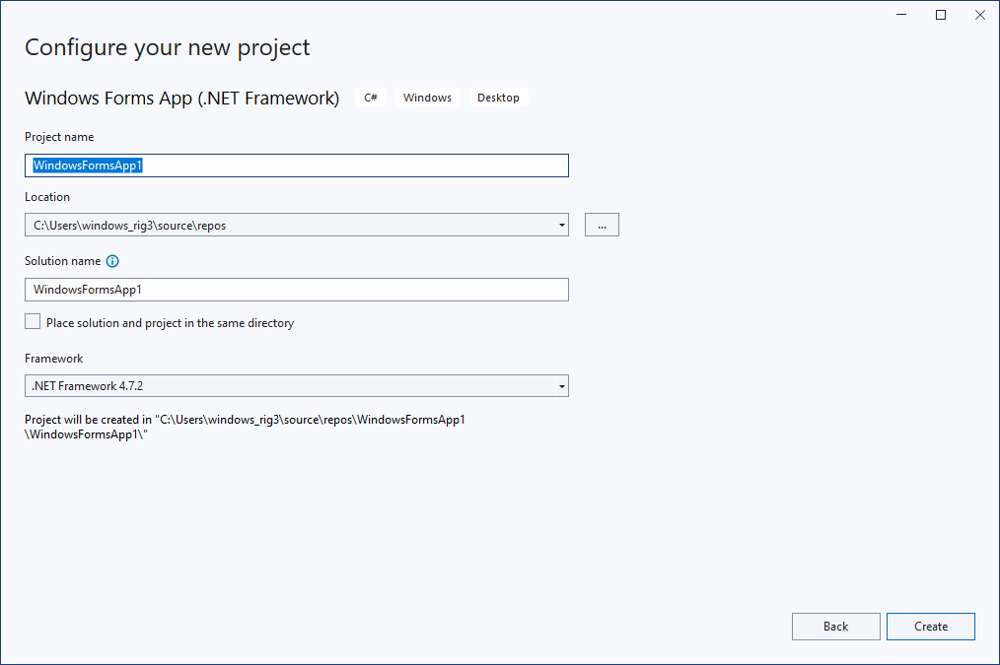
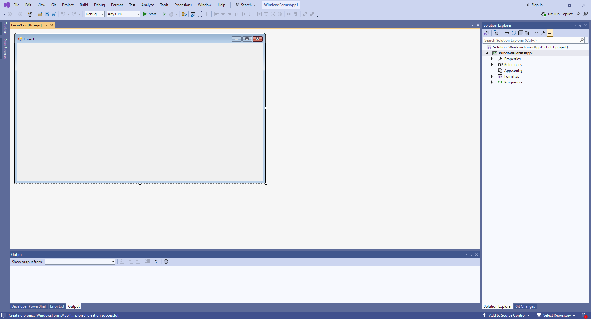
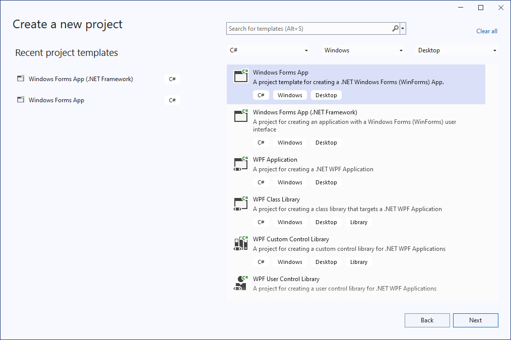
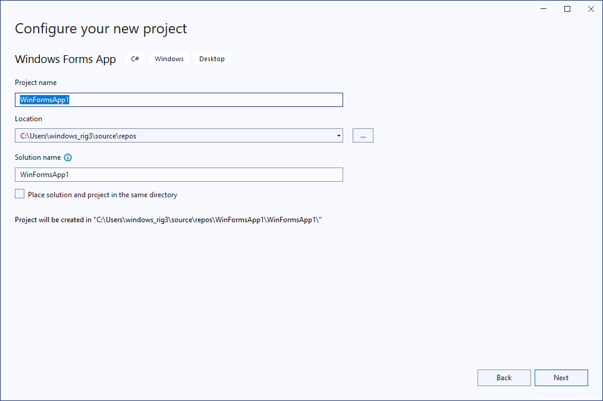
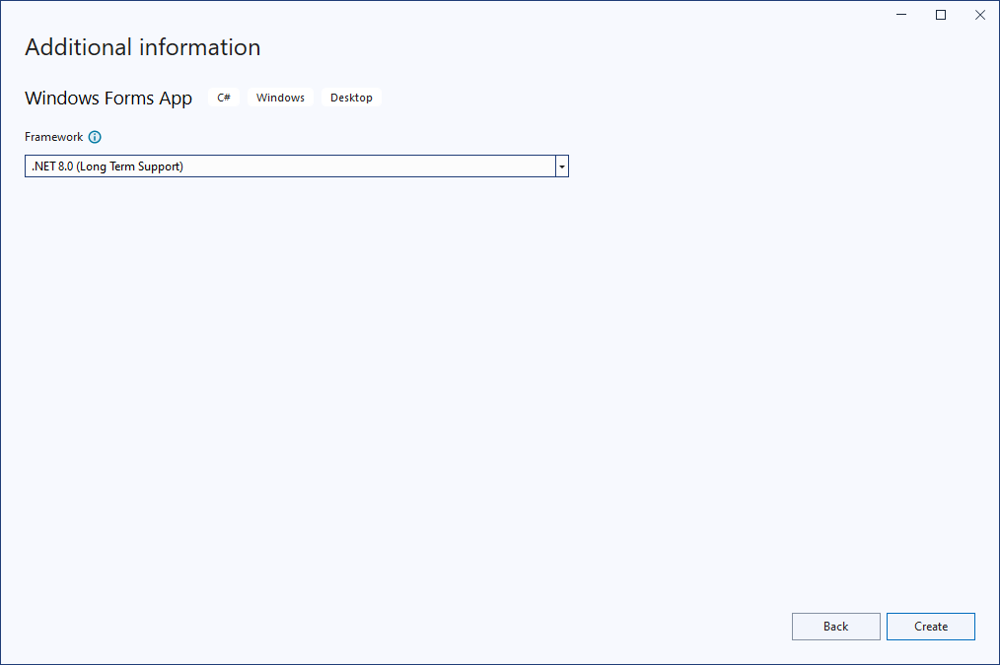
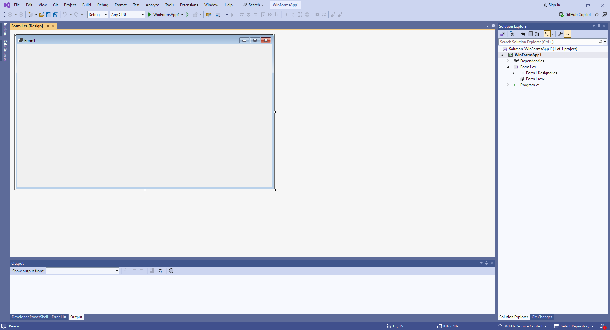

Here’s a clear breakdown of the difference between `WinFormsApp` and `WindowsFormsApp`, and how to **create** a Windows Forms App using **Visual Studio 2022**:

---

### ✅ 1. **Difference: `WinFormsApp` vs `WindowsFormsApp`**

These are just **project names**, not technical differences. You can name your Windows Forms app anything, like:

* `WinFormsApp`
* `WindowsFormsApp`
* `POSFormApp`
* `InventoryApp`

What matters is the **project type**, which should be:
`Windows Forms App (.NET Framework)` or `Windows Forms App (.NET)`.

---

### 🛠️ 2. **How to Create a Windows Forms App in Visual Studio 2022**

#### Option A: .NET Framework (Classic Windows Forms)

Use this if you're working with legacy apps or want maximum compatibility.

1. **Open Visual Studio 2022**
2. **Click**: `Create a new project`
3. **Search**: `Windows Forms App (.NET Framework)`
4. **Select** the template: `Windows Forms App (.NET Framework)`
5. **Click Next**
6. **Project Name**: Enter `WinFormsApp` or `WindowsFormsApp`
7. **Location**: Choose a folder
8. **Framework**: Pick `.NET Framework 4.8` or any other version
9. **Click Create**

#### Option B: .NET Core / .NET 6/7/8 (Modern)

Use this if you're building a modern app.

1. **Open Visual Studio 2022**
2. **Click**: `Create a new project`
3. **Search**: `Windows Forms App`
4. **Select** the template: `Windows Forms App`
5. **Click Next**
6. **Project Name**: e.g., `WinFormsApp`
7. **Framework**: Choose `.NET 6`, `.NET 7`, or `.NET 8`
8. **Click Create**

---

### 🔄 Project Structure (Default)

You’ll get:

```
- Program.cs
- Form1.cs
  - Form1.Designer.cs
  - Form1.resx
```

You can start dragging UI components from the **Toolbox** into your form.

---

### ✅ Tips

* Use `.NET Framework` if you're working with old libraries or COM components.
* Use `.NET 6/7/8` for new projects with better performance and future support.
* You can rename the project after creation, but project folder and namespaces might need manual update.

---

Let me know if you'd like a video-style guide, sample code, or migration between the two types!


# Windows Forms comparison

Good question 👍 — this is **one of the most important choices** when starting a new C# WinForms project. Let’s break it down clearly so you can pick **the best one for your needs**.

---

## 🧩 1. **Windows Forms App (.NET Framework)**

**Target:** The *old* .NET Framework (up to version 4.8.1)
**Released:** 2002 → Still supported, but **only on Windows**

### ✅ Advantages:

* Works well with **legacy Windows apps**.
* Compatible with **old libraries** (DLLs) built for .NET Framework.
* Supports **Windows-only APIs** like `System.Drawing.Printing` or COM interop.
* Most **tutorials, old examples, and NuGet packages** are designed for this.

### ❌ Disadvantages:

* **No cross-platform support** (Windows only).
* **No future improvements** — .NET Framework is **in maintenance mode**.
* Slower performance compared to modern .NET.
* Can’t use the latest C# language features easily.

---

## ⚙️ 2. **Windows Forms App (.NET)**

**Target:** The modern **.NET 6 / 7 / 8** runtime (cross-platform base, but WinForms UI only on Windows).
**Recommended for:** New projects in Visual Studio 2022+

### ✅ Advantages:

* **Modern .NET runtime** (faster, smaller, better memory management).
* **Long-term future support** — Microsoft invests in modern .NET.
* Can use the latest **C# language features** (C# 12 and beyond).
* **Side-by-side versioning** — no system-wide .NET Framework conflicts.
* Easier integration with **modern APIs**, **NuGet**, **dependency injection**, etc.

### ❌ Disadvantages:

* Some **old libraries (DLLs)** built for .NET Framework **won’t work**.
* Fewer **third-party controls** (though improving quickly).
* Still **Windows-only UI**, not truly cross-platform.

---

## 💡 Recommendation

| Scenario                                                               | Recommended Option                                           |
| ---------------------------------------------------------------------- | ------------------------------------------------------------ |
| You’re maintaining or updating an **old WinForms project**             | **Windows Forms App (.NET Framework)**                       |
| You’re starting a **new project**                                      | ✅ **Windows Forms App (.NET)** (latest version, e.g. .NET 8) |
| You need **maximum compatibility** with old DLLs or COM objects        | **.NET Framework**                                           |
| You want **performance, modern language features, and future support** | **.NET (Core)**                                              |

---

## 🧠 In short:

> **Use “Windows Forms App (.NET)” for all new WinForms projects**
> unless you must integrate with old .NET Framework–only libraries.

---

If you tell me your **project type** (e.g., hardware control with ADB, serial communication, database app, etc.),
I can recommend the **best runtime version** (like .NET 6 vs .NET 8) and Visual Studio template.

Would you like me to help you choose the **exact .NET version** for your WinForms project?








