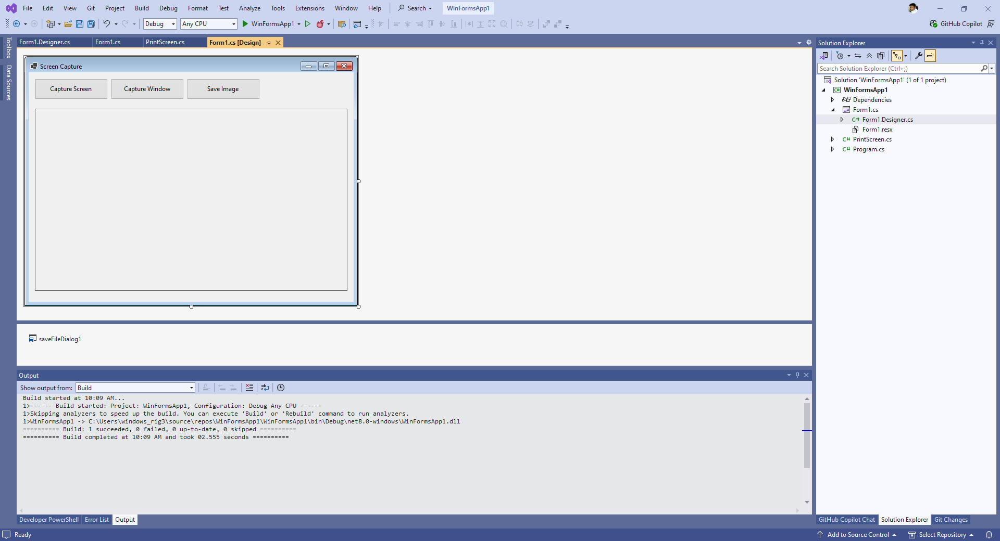

```
https://stackoverflow.com/questions/39760371/can-i-screenshot-or-printscreen-with-a-console-application-without-excess-refere
```

`PrintScreen.cs`

```csharp
using System;
using System.Collections.Generic;
using System.Drawing.Imaging;
using System.Linq;
using System.Runtime.InteropServices;
using System.Text;
using System.Threading.Tasks;


namespace WinFormsApp1
{
    public class PrintScreen
    {
        /// <summary>
        /// Creates an Image object containing a screen shot of the entire desktop
        /// </summary>
        /// <returns></returns>
        public Image CaptureScreen()
        {
            return CaptureWindow(User32.GetDesktopWindow());
        }

        /// <summary>
        /// Creates an Image object containing a screen shot of a specific window
        /// </summary>
        /// <param name="handle">The handle to the window. (In windows forms, this is obtained by the Handle property)</param>
        /// <returns></returns>
        public Image CaptureWindow(IntPtr handle)
        {
            // get te hDC of the target window
            IntPtr hdcSrc = User32.GetWindowDC(handle);
            // get the size
            User32.RECT windowRect = new User32.RECT();
            User32.GetWindowRect(handle, ref windowRect);
            int width = windowRect.right - windowRect.left;
            int height = windowRect.bottom - windowRect.top;
            // create a device context we can copy to
            IntPtr hdcDest = GDI32.CreateCompatibleDC(hdcSrc);
            // create a bitmap we can copy it to,
            // using GetDeviceCaps to get the width/height
            IntPtr hBitmap = GDI32.CreateCompatibleBitmap(hdcSrc, width, height);
            // select the bitmap object
            IntPtr hOld = GDI32.SelectObject(hdcDest, hBitmap);
            // bitblt over
            GDI32.BitBlt(hdcDest, 0, 0, width, height, hdcSrc, 0, 0, GDI32.SRCCOPY);
            // restore selection
            GDI32.SelectObject(hdcDest, hOld);
            // clean up
            GDI32.DeleteDC(hdcDest);
            User32.ReleaseDC(handle, hdcSrc);

            // get a .NET image object for it
            Image img = Image.FromHbitmap(hBitmap);
            // free up the Bitmap object
            GDI32.DeleteObject(hBitmap);

            return img;
        }

        /// <summary>
        /// Captures a screen shot of a specific window, and saves it to a file
        /// </summary>
        /// <param name="handle"></param>
        /// <param name="filename"></param>
        /// <param name="format"></param>
        public void CaptureWindowToFile(IntPtr handle, string filename, ImageFormat format)
        {
            Image img = CaptureWindow(handle);
            img.Save(filename, format);
        }

        /// <summary>
        /// Captures a screen shot of the entire desktop, and saves it to a file
        /// </summary>
        /// <param name="filename"></param>
        /// <param name="format"></param>
        public void CaptureScreenToFile(string filename, ImageFormat format)
        {
            Image img = CaptureScreen();
            img.Save(filename, format);
        }

        /// <summary>
        /// Helper class containing Gdi32 API functions
        /// </summary>
        private class GDI32
        {

            public const int SRCCOPY = 0x00CC0020; // BitBlt dwRop parameter

            [DllImport("gdi32.dll")]
            public static extern bool BitBlt(IntPtr hObject, int nXDest, int nYDest,
                int nWidth, int nHeight, IntPtr hObjectSource,
                int nXSrc, int nYSrc, int dwRop);
            [DllImport("gdi32.dll")]
            public static extern IntPtr CreateCompatibleBitmap(IntPtr hDC, int nWidth,
                int nHeight);
            [DllImport("gdi32.dll")]
            public static extern IntPtr CreateCompatibleDC(IntPtr hDC);
            [DllImport("gdi32.dll")]
            public static extern bool DeleteDC(IntPtr hDC);
            [DllImport("gdi32.dll")]
            public static extern bool DeleteObject(IntPtr hObject);
            [DllImport("gdi32.dll")]
            public static extern IntPtr SelectObject(IntPtr hDC, IntPtr hObject);
        }

        /// <summary>
        /// Helper class containing User32 API functions
        /// </summary>
        private class User32
        {
            [StructLayout(LayoutKind.Sequential)]
            public struct RECT
            {
                public int left;
                public int top;
                public int right;
                public int bottom;
            }

            [DllImport("user32.dll")]
            public static extern IntPtr GetDesktopWindow();
            [DllImport("user32.dll")]
            public static extern IntPtr GetWindowDC(IntPtr hWnd);
            [DllImport("user32.dll")]
            public static extern IntPtr ReleaseDC(IntPtr hWnd, IntPtr hDC);
            [DllImport("user32.dll")]
            public static extern IntPtr GetWindowRect(IntPtr hWnd, ref RECT rect);

        }
    }
}
```

`Form1.Designer.cs`

```csharp
namespace WinFormsApp1
{
    partial class Form1
    {
        /// <summary>
        ///  Required designer variable.
        /// </summary>
        private System.ComponentModel.IContainer components = null;

        /// <summary>
        ///  Clean up any resources being used.
        /// </summary>
        /// <param name="disposing">true if managed resources should be disposed; otherwise, false.</param>
        protected override void Dispose(bool disposing)
        {
            if (disposing && (components != null))
            {
                components.Dispose();
            }
            base.Dispose(disposing);
        }

        //#region Windows Form Designer generated code

        ///// <summary>
        /////  Required method for Designer support - do not modify
        /////  the contents of this method with the code editor.
        ///// </summary>
        //private void InitializeComponent()
        //{
        //    this.components = new System.ComponentModel.Container();
        //    this.AutoScaleMode = System.Windows.Forms.AutoScaleMode.Font;
        //    this.ClientSize = new System.Drawing.Size(800, 450);
        //    this.Text = "Form1";
        //}

        //#endregion

        private System.Windows.Forms.Button btnScreen;
        private System.Windows.Forms.Button btnWindow;
        private System.Windows.Forms.Button btnSave;
        private System.Windows.Forms.PictureBox pictureBoxPreview;
        private System.Windows.Forms.SaveFileDialog saveFileDialog1;
        private void InitializeComponent()
        {
            this.btnScreen = new System.Windows.Forms.Button();
            this.btnWindow = new System.Windows.Forms.Button();
            this.btnSave = new System.Windows.Forms.Button();
            this.pictureBoxPreview = new System.Windows.Forms.PictureBox();
            this.saveFileDialog1 = new System.Windows.Forms.SaveFileDialog();
            ((System.ComponentModel.ISupportInitialize)(this.pictureBoxPreview)).BeginInit();
            this.SuspendLayout();
            // 
            // btnScreen
            // 
            this.btnScreen.Location = new System.Drawing.Point(12, 12);
            this.btnScreen.Name = "btnScreen";
            this.btnScreen.Size = new System.Drawing.Size(140, 40);
            this.btnScreen.Text = "Capture Screen";
            this.btnScreen.UseVisualStyleBackColor = true;
            this.btnScreen.Click += new System.EventHandler(this.btnScreen_Click);
            // 
            // btnWindow
            // 
            this.btnWindow.Location = new System.Drawing.Point(158, 12);
            this.btnWindow.Name = "btnWindow";
            this.btnWindow.Size = new System.Drawing.Size(140, 40);
            this.btnWindow.Text = "Capture Window";
            this.btnWindow.UseVisualStyleBackColor = true;
            this.btnWindow.Click += new System.EventHandler(this.btnWindow_Click);
            // 
            // btnSave
            // 
            this.btnSave.Location = new System.Drawing.Point(304, 12);
            this.btnSave.Name = "btnSave";
            this.btnSave.Size = new System.Drawing.Size(140, 40);
            this.btnSave.Text = "Save Image";
            this.btnSave.UseVisualStyleBackColor = true;
            this.btnSave.Click += new System.EventHandler(this.btnSave_Click);
            // 
            // pictureBoxPreview
            // 
            this.pictureBoxPreview.Location = new System.Drawing.Point(12, 70);
            this.pictureBoxPreview.Name = "pictureBoxPreview";
            this.pictureBoxPreview.Size = new System.Drawing.Size(600, 350);
            this.pictureBoxPreview.SizeMode = System.Windows.Forms.PictureBoxSizeMode.Zoom;
            this.pictureBoxPreview.BorderStyle = System.Windows.Forms.BorderStyle.FixedSingle;
            // 
            // Form1
            // 
            this.ClientSize = new System.Drawing.Size(624, 441);
            this.Controls.Add(this.pictureBoxPreview);
            this.Controls.Add(this.btnSave);
            this.Controls.Add(this.btnWindow);
            this.Controls.Add(this.btnScreen);
            this.Text = "Screen Capture";
            ((System.ComponentModel.ISupportInitialize)(this.pictureBoxPreview)).EndInit();
            this.ResumeLayout(false);
        }
    }
}
```

`Form1.cs`

```csharp
using System.Drawing.Imaging;
using System.Windows.Forms;

namespace WinFormsApp1
{
    public partial class Form1 : Form
    {
        private PrintScreen printScreen = new PrintScreen();
        private Image capturedImage;
        public Form1()
        {
            InitializeComponent();
        }

        private void btnScreen_Click(object sender, EventArgs e)
        {
            capturedImage = printScreen.CaptureScreen();
            ShowImage();
        }

        private void btnWindow_Click(object sender, EventArgs e)
        {
            capturedImage = printScreen.CaptureWindow(this.Handle);
            ShowImage();
        }

        private void ShowImage()
        {
            if (capturedImage != null)
            {
                pictureBoxPreview.Image = capturedImage;
            }
        }

        private void btnSave_Click(object sender, EventArgs e)
        {
            if (capturedImage == null)
            {
                MessageBox.Show("No image to save!");
                return;
            }

            saveFileDialog1.Filter = "PNG Image|*.png|JPEG Image|*.jpg";
            if (saveFileDialog1.ShowDialog() == DialogResult.OK)
            {
                capturedImage.Save(
                    saveFileDialog1.FileName,
                    saveFileDialog1.FileName.EndsWith(".png") ? ImageFormat.Png : ImageFormat.Jpeg
                );
            }
        }
    }
}
```

